# Pirogoff sforna torte apprezzate che nessuno trova

Pirogoff (OÜ Pirogoff.ee, codice di registro 14638232) è una micro-impresa con **€132.318 di ricavi nel 2025**, una **perdita di €7.216**, un patrimonio netto sceso a **€9.135** e un fatturato imponibile **calato del 17,8%** nel primo semestre 2026, posseduta e amministrata da una sola persona, Igor Pak. Non vende più da negozi nei centri commerciali ma da **tre o quattro banconi pop-up dentro gli ipermercati Rimi e Prisma** (Haabersti, Sõpruse, Tiskre, Mustakivi/Lasnamäe), dal proprio e-shop con consegna, per telefono e su **Wolt (4 sedi attive)**, mentre **su Bolt Food oggi non risulta presente**. Il prodotto si chiama correttamente *pirog* in russo e *pirukas* (plurale *pirukad*) in estone: è la grande torta ripiena "della festa", dal protoslavo *pir*, banchetto. Piace a chi lo assaggia (**13 recensioni Facebook positive su 13**), ma quasi nessuno lo trova o lo compra d'impulso: **zero recensioni Google**, **Instagram fermo dal dicembre 2023**, nessun punteggio su Wolt e solo torte intere da 0,9–1 kg a €19–33, contro le **1.981 recensioni Google e 17.828 valutazioni su Bolt Food** del concorrente diretto Nikolay. Le idee del cliente vanno quasi tutte nella direzione giusta ma vanno messe in sequenza: prima sistemare canali digitali e reputazione e lanciare una porzione singola a €3–4, poi testare Balti Jaama Turg o Viru Keskus con spazi temporanei prima di firmare affitti, infine costruire il B2B con prodotti salati refrigerati (2–4 giorni) o surgelati, perché le farce di carne, pesce, uova e ricotta non possono stare a temperatura ambiente. La scatola opaca con finestra va tenuta, mentre il codice rosso-oro-nero con corsivo rosso richiama la Khokhloma russa ed è sconsigliato in Estonia. Il prodotto può stare sul mercato come "torta della festa fatta a mano a Tallinn" in un modello ibrido B2C+B2B, a patto che la direzione chiarisca prima costi, capacità produttiva, stato degli ipermercati ospitanti e ruolo della nuova società all'ingrosso del titolare, Nuvira Foods OÜ.

## Come leggere il rapporto: fonti, affidabilità e conflitti risolti

Il rapporto sintetizza sei filoni di ricerca condotti il **1° ottobre 2026**. Le restrizioni di rete hanno impedito di aprire direttamente la maggior parte delle pagine web. Due filoni (due diligence societaria e audit digitale) hanno letto le pagine pubbliche tramite scraping lato server: registro delle imprese, Inforegister, pirogoff.ee, Wolt, Bolt Food, Instagram, Facebook, Google Maps e PageSpeed. Gli altri quattro (location e delivery, mercato e concorrenti, prodotto e naming, B2B/laboratori/packaging) si sono basati su riassunti e snippet dei motori di ricerca. Come concordato con il coordinamento, quando le fonti divergono prevale il dato letto dal vivo il 1° ottobre 2026. Ogni tabella riporta una colonna "Affid." con tre livelli:

| Sigla | Significato | Uso consigliato |
|---|---|---|
| **V** | Verificato: letto dalla pagina pubblicata (scraping del 01/10/2026) o da registri ufficiali | Utilizzabile, ma da riaprire sulla fonte originale prima di metterlo in una slide |
| **S** | Solo snippet di motore di ricerca: la pagina non è stata aperta | Da verificare sulla fonte prima di qualsiasi uso esterno |
| **E** | Stima o calcolo del team di ricerca, su ipotesi dichiarate | Solo come ordine di grandezza, sempre etichettato come stima |

Le fonti si contraddicono su diversi punti importanti. La tabella seguente indica come li abbiamo risolti e cosa resta da confermare con la direzione.

| # | Tema | Cosa dicono le fonti | Risoluzione adottata | Da confermare con la direzione |
|---|---|---|---|---|
| 1 | Punti vendita aperti | Le note basate su snippet elencano come attivi Ülemiste, Solaris, Kristiine e Järve, e una nota dà per certo che Pirogoff "lavori già a Ülemiste". Lo scraping live mostra che la pagina ordini del sito elenca solo Haabersti Rimi, Tiskre Prisma e Sõpruse Rimi, e Wolt aggiunge Mustakivi. Wolt Ülemiste risulta "non più su Wolt"; Solaris e Kristiine restituiscono 404 ([pirogoff.ee/order](https://pirogoff.ee/order/); [Wolt Ülemiste](https://wolt.com/en/est/tallinn/venue/pirogoff-ulemiste)) | Oggi i punti vendita sono **3–4 banconi in ipermercati**; le unità nei centri commerciali sono chiuse | Date di apertura e chiusura di ogni punto; Mustakivi ha un bancone con personale o è solo un punto di ritiro Wolt? |
| 2 | Bolt Food | Una nota basata su snippet indica Pirogoff su Bolt (Kristiine, Tiskre, Haabersti). Due scraping live distinti trovano **0 sedi**: gli URL storici non restituiscono dati, mentre lo stesso scraper trova 15 locali per "pirukad", quindi funzionava ([Bolt Food Tiskre, URL storico](https://food.bolt.eu/et-EE/1-tallinn/p/33420-pirogoff-tiskre)) | **Pirogoff non è attivo su Bolt Food.** La frase "Wolt ja Bolt" sul sito è obsoleta | Quando e perché è uscito da Bolt; si può riattivare l'account? |
| 3 | Prezzi su Wolt | Gli snippet danno €18 per carota e cavolo-uovo e €28 per pollo-porcini. Lo scraping live dà €21, €21 e €30; Wolt coincide con il sito, salvo salmone-spinaci e manzo (€34 contro €33) ([Wolt Mustakivi](https://wolt.com/et/est/tallinn/venue/pirogoff-mustakivi)) | Si usano i prezzi live | — |
| 4 | Dipendenti | Uno snippet indica "1 dipendente (2024)". Dai dati EMTA trimestrali risultano 1–2 dipendenti nel 2024 e 1–4 nel 2025; per il 2025 il registro indica 2 e Inforegister 4 | Da **1 a 4 dipendenti registrati**, verosimilmente part-time | Numero reale di FTE, incluso il titolare, e suo compenso |
| 5 | Stato della società | Uno snippet segnala un "marcatore rosso" su Inforegister e una versione inglese del registro mostrava un avviso di cancellazione. Lo scraping live indica: società iscritta e attiva, nessun debito fiscale, nessuna procedura, rating "Trustworthy" al 30/09/2026 ([e-Äriregister](https://ariregister.rik.ee/eng/company/14638232/O%C3%9C-Pirogoff.ee?active_tab=tax); [Inforegister](https://www.inforegister.ee/en/14638232-PIROGOFF-EE-OU/)) | **Società attiva.** L'avviso è probabilmente un artefatto dell'interfaccia | Controllo manuale su ametlikudteadaanded.ee |
| 6 | Ricavi 2025 | Uno snippet riporta una "previsione 2025 di €136.791"; il bilancio depositato riporta €132.318 | Si usa il **bilancio depositato** | — |
| 7 | Ipermercati ospitanti | Coop annuncia la conversione dei Prisma estoni in Coop (Kristiine Prisma riaperto come Coop il 6 ottobre, anno probabilmente 2025, tutte le conversioni entro fine novembre) ([Coop](https://www.coop.ee/coop-on-kohal)); sito e Google indicano ancora "Tiskre Prisma" e "Prisma Lasnamäe" | **Non risolto** | Tiskre e Lasnamäe sono oggi Coop? Il contratto di concessione è passato a Coop? |
| 8 | Dati finanziari di Reval Café | Per Reval Coffee OÜ uno snippet riporta €34,29 mln di "entrate" e €6,71 mln di utile nel 2024 (cifre implausibili); per Esperan OÜ, la società che gestisce i caffè, €8,31 mln di ricavi nel 2024 | Si usa **Esperan OÜ**, con riserva (S) | — |
| 9 | Numero di prodotti | 21 salati + 12 dolci (elenco prodotti) contro 20 + 11 (home page); entrambi i dati sono live | **31–33 referenze** | — |
| 10 | Andamento del mercato dei prodotti da forno | Nielsen: pane e prodotti da forno −2% a valore e −3% a volume nel 2025. Euromonitor: prodotti da forno in crescita a valore e volume | Le due fonti misurano perimetri diversi; si riportano entrambe | — |

## 1. Punti vendita e canali: banconi negli ipermercati, e-shop e solo Wolt

### I tre o quattro punti vendita attuali sono pop-up negli ipermercati, non negozi

La pagina ordini di pirogoff.ee elenca **solo tre punti vendita, tutti dentro ipermercati**: Haabersti Rimi Hyper (Haabersti 1), Tiskre Prisma (Liiva tee 61, Tiskre, comune di Harku) e Sõpruse Rimi (Sõpruse pst 174) ([pirogoff.ee/order](https://pirogoff.ee/order/)). Wolt ne aggiunge un quarto, **Pirogoff Mustakivi (Mustakivi tee 17, dentro Prisma Lasnamäe)**. È anche l'unico pin Pirogoff su Google Maps, non rivendicato dal titolare e senza recensioni ([Google Maps](https://www.google.com/maps/search/?api=1&query=Pirogoff&query_place_id=ChIJbfwVagDtkkYRCBclwcLspeg); [Wolt Mustakivi](https://wolt.com/et/est/tallinn/venue/pirogoff-mustakivi)). Il formato è quello del pop-up. A Haabersti il banco si trova "vicino all'ingresso principale dell'edificio commerciale" Rimi Hyper ([pirogoff.ee Haabersti](https://pirogoff.ee/haabersti-rimi-pirogoff/)). Tiskre è presentata come **"il cuore dell'azienda"**, dove "i nostri panettieri e cuochi" sfornano ogni giorno, quindi è insieme laboratorio e punto vendita ([pirogoff.ee Tiskre](https://pirogoff.ee/tiskre-prisma-pirogoff/)). Le quattro unità nei centri commerciali citate dalle fonti più vecchie risultano **chiuse**: Ülemiste Keskus, Järve Keskus, Solaris e Kristiine. Le loro pagine restano però sul sito, e Facebook indica ancora Ülemiste come indirizzo dell'azienda ([Facebook](https://www.facebook.com/Pirogoff.ee)). Anche gli orari sono incoerenti fra pagina ordini, pagine dei singoli punti, Google e Wolt. Quasi tutti i banconi sono **chiusi martedì e mercoledì** e aprono alle 12. Questo indica poco personale e un'offerta che rinuncia alla colazione e al flusso mattutino dei pendolari.

| Punto vendita | Indirizzo | Formato | Orari dichiarati (fonti in conflitto) | Wolt (01/10/2026) | Google Maps | Affid. |
|---|---|---|---|---|---|---|
| Haabersti Rimi Hyper | Haabersti 1, Tallinn | Pop-up all'ingresso principale | Pagina ordini: lun–dom 12–21. Pagina del punto: mer–dom oppure gio–lun, chiuso mar e mer | Attivo | Nessun pin proprio | V |
| Sõpruse Rimi | Sõpruse pst 174, Tallinn | Bancone dentro il Rimi | Lun–dom 12–21 oppure gio–lun (il titolo HTML della pagina è ancora "Järve keskus") | Attivo | Nessun pin proprio | V |
| Tiskre Prisma | Liiva tee 61, Tiskre | Laboratorio di produzione e vendita | Lun e gio–dom, apertura alle 10 o alle 12 secondo la fonte, chiusura alle 21; chiuso mar e mer | Attivo, ma offline al momento dello scraping (gio 1/10, ore 12:05 circa) | Nessun pin proprio | V |
| Prisma Lasnamäe (Mustakivi) | Mustakivi tee 17, Tallinn | Dentro Prisma Lasnamäe; assente dall'elenco del sito | Lun 12–21; mar e mer chiuso; gio–dom 12–21 | Attivo | Unico pin, non rivendicato, 0 recensioni | V |

Fonti: [pirogoff.ee/order](https://pirogoff.ee/order/); [pirogoff.ee Sõpruse](https://pirogoff.ee/sopruse-rimi/); [Wolt Sõpruse Rimi](https://wolt.com/et/est/tallinn/venue/sopruse-rimi-pirogoff); [Wolt Haabersti](https://wolt.com/et/est/tallinn/venue/haabersti-rimi-hyper-pirogoff); [Wolt Tiskre](https://wolt.com/et/est/tallinn/venue/tiskre-prisma-pirogoff).

Le fonti datate permettono di ricostruire l'evoluzione della rete. Nel novembre 2021 i punti di ritiro erano Ülemiste e Haabersti Rimi ([Chilli.ee](https://chilli.ee/et/vaata-pakkumist/pirukad-pirogoff-ee)). A metà 2022 si erano aggiunti Tiskre Prisma e Järve Keskus ([Instagram, 9 luglio 2022](https://www.instagram.com/p/CfzMF5NNybJ/)). Nel febbraio 2023 Pirogoff ha aperto un pop-up al Solaris ([Instagram, 23 febbraio 2023](https://www.instagram.com/p/CpAqT_6ttjE/)). Nell'aprile 2024 cercava ancora un addetto vendite per Järve, Pärnu mnt 238, a €840–1.200 lordi al mese ([CVPro](https://www.cvpro.ee/vacancies/4c83a2ae-4467-4ad5-80eb-64fcf80b6f3f)). Nel gennaio 2025 Facebook elencava Haabersti, Kristiine, Järve, Solaris e Tiskre ([Facebook, 25 gennaio 2025](https://www.facebook.com/Pirogoff.ee/posts/pfbid02UrWwEnhKxQAYrd9mBmfXgBCnTDiYRnf2AGJT5MDrKMxjEoYSuq5KwmUewaWFapmdl)). Nell'ottobre 2026 restano Haabersti, Tiskre e Sõpruse, più Mustakivi su Wolt. Fra l'aprile 2024, quando Facebook elencava ancora Ülemiste ([Facebook, aprile 2024](https://www.facebook.com/Pirogoff.ee/posts/pfbid02er6SM7SAyRCahQ7vEtrzQENq7A8gutBwyfuKQBHx9YJhkZq7vVYLqNQ5VAJn3SWWl)), e l'ottobre 2026 sono quindi stati chiusi quattro punti in centri commerciali. Nell'agosto 2026 l'azienda ha pubblicato un nuovo annuncio per un addetto vendite ([CV Keskus](https://www.cvkeskus.ee/muuja-tallinnas-ou-pirogoffee-1049869)).

| Punto storico | Periodo documentato | Stato al 01/10/2026 | Evidenza | Affid. |
|---|---|---|---|---|
| Ülemiste Keskus (Suur-Sõjamäe 4), 1° piano accanto a Euronics | Novembre 2021 – almeno aprile 2024 | Chiuso | Wolt: "non più su Wolt"; assente dall'elenco del sito | V |
| Järve Keskus (Pärnu mnt 238) | Metà 2022 – almeno gennaio 2025 | Chiuso; probabilmente sostituito da Sõpruse Rimi | Pagina riutilizzata per Sõpruse | V |
| Solaris (Estonia pst 9) | Febbraio 2023 – almeno gennaio 2025 | Chiuso | Wolt: 404 | V |
| Kristiine Keskus (Endla 45) | Data ignota – almeno gennaio 2025 | Chiuso | Wolt: 404; Bolt: URL storico senza dati | V |

Due fatti sull'ubicazione pesano sul piano di rilancio. Primo: a Mustakivi tee 17, nello stesso edificio, opera Pagaripoisid, che su Wolt ha un punteggio di **9,6** e su Bolt di **4,81 su 2.291 valutazioni** ([Wolt Pagaripoisid Mustakivi](https://wolt.com/en/est/tallinn/venue/pagaripoisid-mustakivi)). Secondo: Coop dichiara di aver convertito i Prisma estoni in Coop ([Coop](https://www.coop.ee/coop-on-kohal), S). Se Tiskre e Lasnamäe sono già Coop, il "padrone di casa" di due banconi su quattro ha una propria cucina, Coop Kokad, e forni in negozio ([Coop Kokad](https://coopkokad.ee/et)). In pratica è un concorrente.

### Quattro canali attivi, Bolt Food assente e nessun B2B

Oggi i canali attivi sono: i banconi; l'**e-shop WooCommerce**, in estone e russo, con consegna a €6 entro Tallinn e gratis oltre €50, scelta di data e fascia oraria e pagamento solo con bonifico bancario online (pangalink) ([pirogoff.ee/kohaletoimetamine](https://pirogoff.ee/kohaletoimetamine/)); gli ordini telefonici al +372 55 960 950; **Wolt**. La pubblicità a pagamento su Meta funziona come canale di acquisizione. **Bolt Food non è attivo** e non risulta alcun canale B2B: nessun bar, catering aziendale o scaffale in supermercato.

| Canale | Stato al 01/10/2026 | Dettagli | Affid. |
|---|---|---|---|
| Banconi negli ipermercati | Attivi (3–4) | Solo torte intere; quasi tutti chiusi mar–mer | V |
| E-shop pirogoff.ee | Attivo | WooCommerce; estone e russo, niente inglese; €6 di consegna, gratis oltre €50; solo bonifico bancario online. Nel 2021–22 la consegna costava €5, gratis oltre €30–40, con pagamento anche in contanti o carta alla consegna | V |
| Telefono | Attivo | +372 55 960 950 | V |
| Wolt | Attivo, 4 sedi | Nessun punteggio visibile; 5–9 torte per sede (Mustakivi 5, Sõpruse 7, Haabersti 5, Tiskre 9); tag "bakery" | V |
| Bolt Food | **Non attivo** | 0 sedi trovate; il sito dice ancora "Wolt ja Bolt" | V |
| Pubblicità Meta | Attiva | Annunci di catalogo dinamici (DPA) dal 25/03/2024; 2 attivi il 01/10/2026; promozione estiva −20% sopra €100 (codice HOTSUMMER10020) | V |
| Gruppi d'acquisto (Chilli.ee) | Storico | Offerta −10% scaduta il 30/11/2021 | V |
| B2B, catering, scaffale | Nessuna evidenza | Nessun cliente trovato | V |

Fonti: [Wolt Mustakivi](https://wolt.com/et/est/tallinn/venue/pirogoff-mustakivi); [Wolt Sõpruse](https://wolt.com/et/est/tallinn/venue/sopruse-rimi-pirogoff); [Bolt Food Haabersti, URL storico](https://food.bolt.eu/et-EE/1-tallinn/p/26198-pirogoff-haabersti); [Meta Ad Library "Pirogoff"](https://www.facebook.com/ads/library/?active_status=all&ad_type=all&country=EE&q=Pirogoff&search_type=keyword_unordered&media_type=all); [Instagram, aprile 2022](https://www.instagram.com/p/Cc2k8gcNdrL/).

## 2. Il prodotto: si chiama pirog, in estone pirukas, ed è la torta della festa

### Pirogoff vende 31–33 torte intere grandi, senza un formato d'ingresso

Il catalogo comprende **20–21 torte salate a €21–33** e **11–12 torte dolci a €19–29**, tutte intere. Pesano 0,9–1 kg e sono rotonde (22–24 cm) o rettangolari (38×15 cm). Gran parte delle ricette è disponibile sia in **pasta lievitata (pärmitaigen)** sia in **pasta frolla (muretaigen)**, allo stesso prezzo ([pirogoff.ee](https://pirogoff.ee/); [scheda prodotto](https://pirogoff.ee/product/karjuse-pirukas-lihaga-shepherds-pie/)). Le schede sono insolitamente complete: ingredienti con percentuali di farcia, valori nutrizionali per 100 g, allergeni e la dicitura **"säilivusaeg 24h toatemperatuuril"** (conservazione 24 ore a temperatura ambiente) su ogni prodotto. Questa dicitura va validata in laboratorio (sezione 5). Il prezzo al kg va da **€21 a €37**. Le torte più costose sono salite da circa €26 nel 2021 a €33 nel 2026, cioè **+27%** ([Chilli.ee](https://chilli.ee/et/vaata-pakkumist/pirukad-pirogoff-ee)). Mancano fette, mini-torte, porzioni singole e un listino catering. Il sito parla di "veganipirukad", ma nessun prodotto è etichettato come vegano.

| Categoria | Referenze | Peso e formato | Impasto | Prezzo | €/kg | Affid. |
|---|---|---|---|---|---|---|
| Salate (soolased pirukad) | 20–21 | 0,9–1 kg; 24 cm oppure 38×15 cm | Lievitata o frolla (alcune solo frolla) | €21–33 | €21–37 | V |
| Dolci (magusad pirukad) | 11–12 | 0,9–1 kg; 22–24 cm | Lievitata o frolla | €19–29 | €21–32 | V |
| Esempi | Karjuse pirukas lihaga (Shepherd's pie) €27; Kana-puravikupirukas (pollo e porcini) €30; Lõhe-spinatipirukas (salmone e spinaci, "la nostra variazione sulla classica torta di pesce russa") €33; Pirn ja gorgonzola €29; Kapsa-munapirukas (cavolo e uovo) €21; Moonipirukas (semi di papavero) €27; Õunapirukas (mela) €19 | | | | | V |

Fonte: [pirogoff.ee](https://pirogoff.ee/).

Le recensioni dei clienti citano come preferite le torte **cavolo-uovo, carota, salmone-spinaci, limone e feta-pomodoro** ([recensioni Facebook](https://www.facebook.com/Pirogoff.ee/reviews)). La gamma unisce classici russi ed est-europei (maiale-cavolo, cavolo-uovo, papavero, cipollotto-uovo) a ripieni europei e italiani (pera-gorgonzola, ricotta-porcini, pomodoro-mozzarella). È già, di fatto, una **pasticceria moderna dell'Europa orientale**. **Non fa torte ossete** e non fa *pirozhki* da passeggio. La confusione nasce da omonimi in Russia e Kazakistan ([Pirogoff Astana](https://www.instagram.com/pirogoff_ast/); [Lider-Pirogoff Mosca](https://lider-pirogoff.ru/)).

### Il nome corretto viene dal protoslavo pir, "banchetto"

*Pirog* (russo пирог) deriva dal protoslavo *pir*, "banchetto, festa", secondo il dizionario etimologico di Vasmer ([Wikipedia: Pirog](https://en.wikipedia.org/wiki/Pirog); [Wiktionary: pirog](https://en.wiktionary.org/wiki/pirog)). Il finlandese *piiras/piirakka* è un prestito dall'antico slavo orientale *pirogŭ* ([Wiktionary: piirakka](https://en.wiktionary.org/wiki/piirakka)). L'estone *pirukas* è il prestito parallelo, ormai parola pienamente nativa (S; da confermare sul dizionario etimologico EKI). Dalla stessa radice viene il polacco *pieróg/pierogi* ([Wikipedia: Pierogi](https://en.wikipedia.org/wiki/Pierogi)). Il prodotto di Pirogoff è dunque, a pieno titolo, un **pirog**: una torta grande, intera, da tagliare in tavola. In estone l'azienda usa già i termini corretti, "soolased pirukad" e "magusad pirukad". C'è però una sfumatura che conta per i nuovi formati: nell'uso quotidiano estone *pirukas* indica soprattutto il **fagottino ripieno individuale**, ottenuto ritagliando dischi di pasta ([Estonian World](https://estonianworld.com/life/the-pirukas-vs-the-empanada-and-other-ethnic-dumplings/)). La mini-torta "da passeggio" proposta dal cliente coinciderebbe quindi con il *pirukas* che ogni estone conosce, e in russo si chiamerebbe *pirozhok* (пирожок, plurale *pirozhki*).

| Tipo di prodotto | Russo | Estone | Inglese | Italiano | Pirogoff lo fa? |
|---|---|---|---|---|---|
| Categoria: torta grande ripiena, salata o dolce | пирог (pirog) | pirukas / pirukad | pie / Eastern European pie | torta salata / torta dolce ("pirog", torta ripiena dell'Europa orientale) | Sì: è il prodotto principale |
| Torta salata chiusa in pasta lievitata | закрытый дрожжевой пирог | pärmitainapirukas | yeast-dough savory pie | torta salata lievitata | Sì |
| Torta salata in pasta frolla | пирог из песочного теста | muretainapirukas | shortcrust savory pie / savory tart | torta salata in pasta brisée | Sì |
| Torta dolce aperta ai frutti di bosco | открытый ягодный пирог | marjapirukas / marjakook | berry tart | crostata ai frutti di bosco | Sì |
| Torta dolce con ricotta o quark | пирог с творогом | kohupiima-/ricottapirukas | ricotta pie | torta di ricotta | Sì |
| Fagottino individuale da mano | пирожок (pirozhok) | pirukas (piccolo) | hand pie | fagottino / mini-torta ripiena | **No (opportunità)** |
| Kulebyaka: chiusa, rettangolare, a strati separati da blini | кулебяка | — | coulibiac | — | No (le torte rettangolari 38×15 cm non lo sono) |
| Kurnik: rotonda a cupola, pasta ricca, pollo | курник | — | kurnik | — | No |
| Rasstegai: piccola, aperta, con foro per il brodo | расстегай | — | rasstegai | — | No |
| Torte ossete (fyddzhin, tsakharadzhin, ualibakh, kartofdzhin) | осетинский пирог | osseedi pirukas | Ossetian pie | — | No |

Fonti per i tipi tradizionali: [RuWiki: Кулебяка](https://ru.ruwiki.ru/wiki/%D0%9A%D1%83%D0%BB%D0%B5%D0%B1%D1%8F%D0%BA%D0%B0); [AiF: rasstegai e kulebyaka](https://aif.ru/food/world/chem_otlichaetsya_rasstegay_ot_kulebyaki); [Wikipedia: Kurnik](https://en.wikipedia.org/wiki/Kurnik_%28pirog%29); [Wikipedia: Ossetian cuisine](https://en.wikipedia.org/wiki/Ossetian_cuisine). Le traduzioni sono proposte del team (E), da far rivedere a un madrelingua.

Le varianti regionali completano la storia. Le torte ossete si servono sempre in **numero dispari**: tre nelle occasioni liete, due ai funerali ([Google Arts & Culture](https://artsandculture.google.com/story/ossetian-pies-why-do-they-come-in-an-odd-number-federal-agency-for-tourism/CwUhZO_d1CpCrQ?hl=en)). Il *karjalanpiirakka* careliano, sfoglia di segale con riso, è **Specialità Tradizionale Garantita UE dal 2003** ([Wikipedia: Karelian pasty](https://en.wikipedia.org/wiki/Karelian_pasty)). I *speķa pīrāgi* lettoni sono la pasta ripiena più nota della Lettonia ([Wikipedia: Speķrauši](https://en.wikipedia.org/wiki/Spe%C4%B7rau%C5%A1i)). La radice comune pirog–pieróg–pīrāgs–pirukas–piirakka permette di raccontare il prodotto come **"la torta della festa del Baltico e dell'Europa orientale"** invece che come "torta russa". È un racconto culturalmente neutro, ed è più sicuro nel contesto estone descritto nella sezione 4.

### Le versioni contemporanee: Stolle, delivery osseto e surgelato industriale

Il riferimento più vicino al formato Pirogoff è **Stolle (Штолле)**, nata nel 2002 con un caffè a San Pietroburgo ([Stolle](https://stollerussia.orgs.biz/)). Stolle ha trasformato il pirog delle feste in una catena con un **formato standard da 1 kg tagliato in 8 porzioni** (per 4–6 persone), ordini via app, consegna e franchising ([blog Stolle Mosca](https://msk.stolle.ru/blog/74); [franshiza.ru](https://franshiza.ru/franchise/read/stolle/)). La rete conta fra 30 e 50 locali secondo le fonti, che però si contraddicono e non sono datate. Il franchising prevede **€50.000 di ingresso, un investimento da €300.000 e il 5% di royalty** (S), e nel 2015 un franchising Stolle ha aperto anche a New York, a Long Island City ([QNS](https://qns.com/2015/10/russian-bakery-comes-to-the-falchi-building-in-lic/)). A Mosca le torte ossete sono un business soprattutto di consegna a domicilio (Пирогомания, Пироги №1, Grandpie, Arfa) ([T-Ж](https://t-j.ru/osetinskiye-pirogi-msk/)). In Estonia la modernizzazione del pirukas è passata dall'industria: **Eesti Pagar**, 110 anni nel 2024 e "100% di proprietà estone", vende *pirukad* surgelati in confezioni per la grande distribuzione ([Postimees](https://majandus.postimees.ee/7950602/labinisti-kodumaine-eesti-pagar-tahistab-koos-eesti-rahvaga-oma-110-sunnipaeva); [Eesti Pagar surgelati](https://eestipagar.ee/tooted/sugavkulmutatud-tooted/jaepakendid/)). In Polonia, nel 2022, molti ristoranti hanno ribattezzato "ukraińskie" i pierogi "ruskie", che in realtà significa "ruteni" ([Notes from Poland](https://notesfrompoland.com/2022/03/02/polish-restaurants-change-name-of-russian-dumplings-to-ukrainian/)). Pirogoff usa già tre delle leve di modernizzazione della categoria: il formato standard, l'ordine con consegna e la vendita al bancone. **Gli mancano la porzione individuale, una linea surgelata e un'offerta per le aziende**, cioè le tre leve che renderebbero il prodotto vendibile d'impulso e all'ingrosso.

## 3. Due diligence: una micro-impresa da 132.000 euro in calo dal 2022

### Un solo socio, nessun organo di controllo e una nuova società all'ingrosso

**OÜ Pirogoff.ee** è una società a responsabilità limitata estone. È stata iscritta l'8 gennaio 2019 con un capitale di €2.500, è registrata ai fini IVA dal 1° aprile 2019 (EE102147298) e ha come attività principale l'EMTAK 10711, produzione di pane e prodotti da forno freschi. **Igor Pak** (nato nel 1964) è socio unico, unico membro del consiglio di amministrazione e titolare effettivo. La sede legale è un appartamento a Ilmandu (comune di Harku), con ogni probabilità l'abitazione del titolare. Non risultano pegni né procedure registrate ([e-Äriregister](https://ariregister.rik.ee/est/company/14638232/O%C3%9C-Pirogoff.ee)). Il 14 luglio 2024 il registro ha emesso un **avviso di sanzione per bilancio non depositato**, sanato il 25 luglio ([e-Äriregister](https://ariregister.rik.ee/est/company/14638232/O%C3%9C-Pirogoff.ee)). Secondo la relazione sulla gestione 2023 l'amministratore non percepisce compenso ([Inforegister](https://www.inforegister.ee/14638232-PIROGOFF-EE-OU/)).

L'elemento più rilevante per un piano di rilancio è la seconda società del titolare. **Nuvira Foods OÜ** (17349379) è stata iscritta il 14 ottobre 2025 con attività di commercio all'ingrosso non specializzato (EMTAK 46901) e ha **la stessa sede legale di Pirogoff**. Dal 12 dicembre 2025 è posseduta al **60% da Yurii Chmyr e al 40% da Igor Pak**. Fino al secondo trimestre 2026 ha dichiarato **zero fatturato, zero imposte e zero dipendenti** ([Inforegister – Nuvira Foods](https://www.inforegister.ee/17349379-NUVIRA-FOODS-OU/)). Un annuncio di lavoro del 2024 indica come contatto un indirizzo e-mail di Julia Pak ([CVPro](https://www.cvpro.ee/vacancies/4c83a2ae-4467-4ad5-80eb-64fcf80b6f3f)). Una società di contabilità, WaveReports OÜ, è collegata a una Julia Pak ([Inforegister – WaveReports](https://www.inforegister.ee/12017612-WaveReports-OU/)), e l'e-mail di Nuvira è wavereports@gmail.com. Ne deduciamo, senza averlo verificato, che contabilità e personale siano gestiti in famiglia. Il quadro è quello di un'**azienda che dipende da una sola persona**. Il titolare potrebbe inoltre preparare un veicolo all'ingrosso con un socio di maggioranza: va chiarito prima di costruire un pitch sul B2B di Pirogoff.

### Ricavi e utili: picco nel 2022, perdita nel 2025

Il 2019 e il 2020 sono stati anni dormienti. L'attività vera è partita fra il secondo e il terzo trimestre 2021, in coincidenza con l'apertura della pagina Facebook (13 giugno 2021). I ricavi hanno toccato il **picco di €167.954 nel 2022** e da allora sono scesi del **21,2%** (calcolo E sui dati V). Il margine netto non ha mai superato l'**8,6%**. L'unico anno davvero in utile, il 2024, coincide con il taglio quasi totale del personale. Quando nel 2025 l'organico è risalito a 3–4 persone, i ricavi non sono cresciuti e il conto economico è andato in **perdita (−5,45%)**. Il nodo è il **volume per punto vendita, non il costo**.

| Anno | Ricavi (€) | Utile netto (€) | Margine netto | Bilancio depositato | Affid. |
|---|---|---|---|---|---|
| 2019 | 55 | 825 | n.s. | 28/12/2020 | V |
| 2020 | 0 | −276 | – | 21/05/2021 | V |
| 2021 | 59.254 | 62 | 0,1% | 29/06/2022 | V |
| 2022 | 167.954 | 458 | 0,27% | 01/06/2023 | V |
| 2023 | 164.784 | 1.251 | 0,76% | 24/07/2024 (in ritardo) | V |
| 2024 | 133.492 | 11.531 | 8,64% | 29/05/2025 | V |
| 2025 | 132.318 | −7.216 | −5,45% | 21/05/2026 | V |
| 2026 (previsione Inforegister) | 115.293 | −1.826 | – | previsione di terzi | E |

Fonti: [e-Äriregister](https://ariregister.rik.ee/est/company/14638232/O%C3%9C-Pirogoff.ee); [e-Krediidiinfo](https://www.e-krediidiinfo.ee/14638232-PIROGOFFEE-O%C3%9C); [Inforegister](https://www.inforegister.ee/en/14638232-PIROGOFF-EE-OU/).

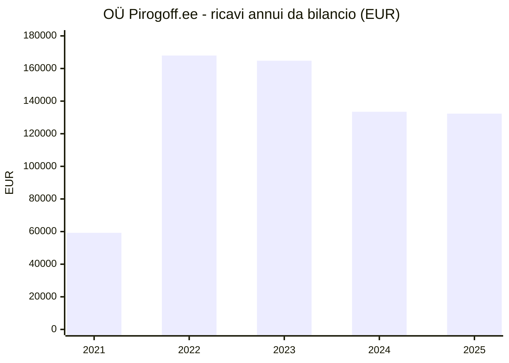

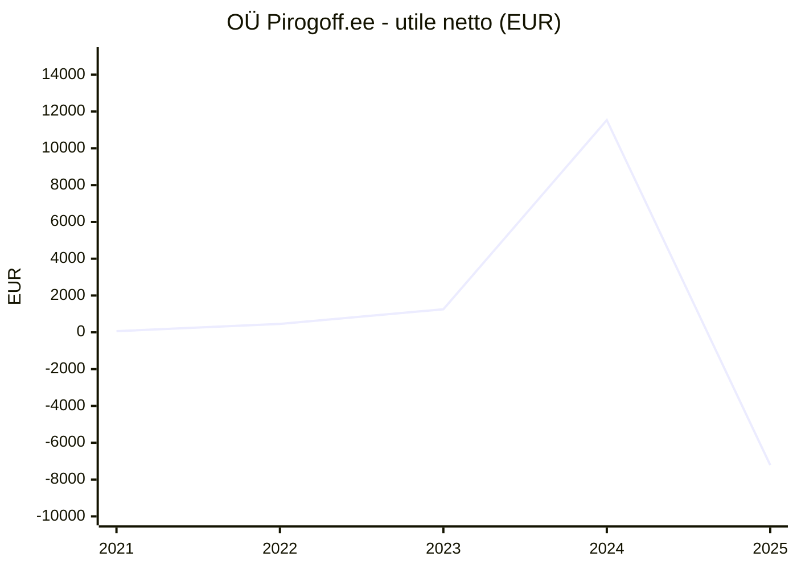

### Il fatturato trimestrale è quasi dimezzato dal picco di fine 2022

I dati trimestrali dell'Agenzia delle entrate estone (EMTA), ripubblicati da Inforegister, mostrano lo stesso andamento con più dettaglio. Il dato del secondo trimestre 2026 coincide con quello ufficiale del registro delle imprese. Dal **picco di €49.834 (T4 2022)** il fatturato è sceso a **€27.362 nel T1 2026 (−45,1%)**. Gli ultimi quattro trimestri sommano circa **€122.900**. Il primo semestre 2026 (€57.070) è **inferiore del 17,8%** allo stesso periodo del 2025 (€69.444). Per l'intero 2026 Inforegister prevede €115.293, cioè −12,9%.

| Trimestre | Fatturato imponibile (€) | Imposte statali (€) | Imposte sul lavoro (€) | Dipendenti registrati | Affid. |
|---|---|---|---|---|---|
| T3 2021 | 15.592 | 614 | 344 | 4 | V |
| T4 2021 | 31.666 | 3.855 | 3.270 | 7 | V |
| T1 2022 | 34.558 | 5.917 | 4.835 | 7 | V |
| T2 2022 | 38.701 | 5.658 | 4.435 | 6 | V |
| T3 2022 | 42.281 | 6.687 | 4.507 | 3 | V |
| T4 2022 | 49.834 | 7.011 | 3.401 | 3 | V |
| T1 2023 | 40.890 | 5.441 | 3.185 | 4 | V |
| T2 2023 | 46.096 | 5.953 | 3.030 | 4 | V |
| T3 2023 | 40.549 | 5.737 | 3.258 | 4 | V |
| T4 2023 | 38.136 | 5.713 | 3.508 | 2 | V |
| T1 2024 | 35.071 | 3.717 | 1.808 | 1 | V |
| T2 2024 | 33.453 | 3.240 | 1.012 | 1 | V |
| T3 2024 | 33.319 | 3.395 | 1.012 | 1 | V |
| T4 2024 | 32.570 | 2.654 | 1.012 | 2 | V |
| T1 2025 | 34.537 | 3.675 | 1.796 | 1 | V |
| T2 2025 | 34.907 | 3.043 | 1.087 | 3 | V |
| T3 2025 | 34.218 | 4.817 | 1.771 | 3 | V |
| T4 2025 | 31.613 | 4.383 | 2.348 | 4 | V |
| T1 2026 | 27.362 | 4.348 | 2.485 | 3 | V |
| T2 2026 | 29.708 | 4.101 | 2.542 | 2 | V |

Fonti: [Inforegister](https://www.inforegister.ee/en/14638232-PIROGOFF-EE-OU/); verifica del T2 2026 su [e-Äriregister](https://ariregister.rik.ee/eng/company/14638232/O%C3%9C-Pirogoff.ee).

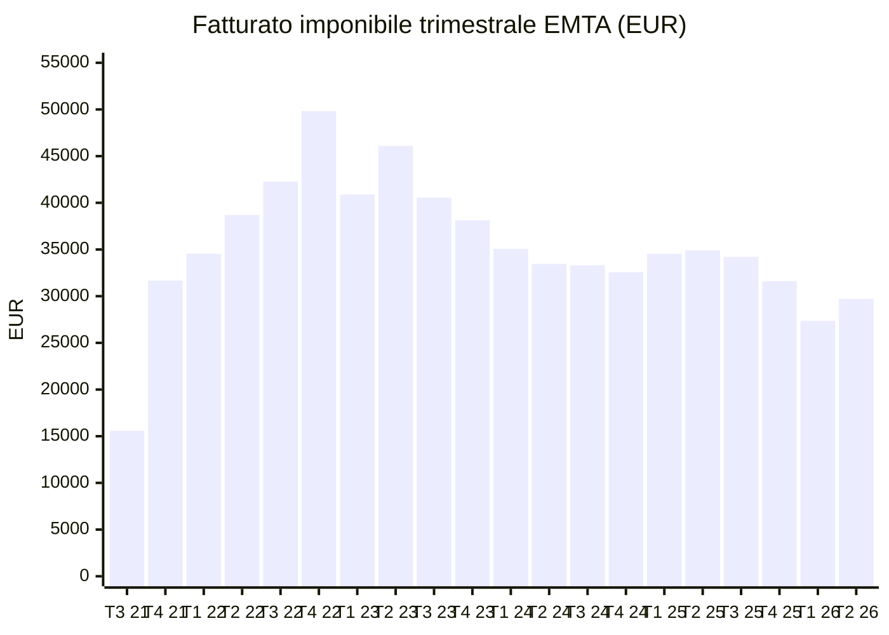

| Anno | Somma fatturato imponibile (€) | Imposte statali (€) | Imposte sul lavoro (€) | Affid. |
|---|---|---|---|---|
| 2022 | 165.374 | 25.273 | 17.178 | V (somma E) |
| 2023 | 165.671 | 22.844 | 12.981 | V (somma E) |
| 2024 | 134.413 | 13.006 | 4.844 | V (somma E) |
| 2025 | 135.275 | 15.918 | 7.002 | V (somma E) |
| 1° semestre 2026 | 57.070 (−17,8% sul 1° sem. 2025) | 8.449 | 5.027 | V (somma E) |

Il personale registrato è sempre stato poco: 1–4 dipendenti dal 2023, con salari medi lordi stimati da Inforegister fra €520 e €910 al mese, quindi probabilmente contratti part-time. È un organico ridotto per 3–4 banconi più il laboratorio, e fa pensare che il titolare lavori in azienda senza compenso. I €4.116 ricevuti in 12 transazioni dal Fondo di assicurazione contro la disoccupazione (Töötukassa) sono probabilmente sussidi per l'assunzione di disoccupati (inferenza non verificata) ([Inforegister](https://www.inforegister.ee/en/14638232-PIROGOFF-EE-OU/)).

### Il patrimonio netto si esaurirebbe in uno o due anni di perdite

| Voce (€) | 2024 | 2025 | 2026 (previsione Inforegister, E) | Affid. 2024–2025 |
|---|---|---|---|---|
| Totale attivo | 39.383 | 23.067 | 19.465 | V |
| Attivo corrente | 32.656 | 19.825 | 16.730 | V |
| Immobilizzazioni | 6.727 | 3.242 | 2.736 | V |
| Passività totali | 23.032 | 13.932 | 12.156 | V |
| Patrimonio netto | 16.351 | 9.135 | 7.309 | V |
| Utile netto | 11.531 | −7.216 | −1.826 | V |
| Capitale circolante netto | 11.529 | 5.893 | 4.574 | V |
| Altri proventi operativi | 978 | 3.941 | – | V |

Fonte: [Inforegister](https://www.inforegister.ee/en/14638232-PIROGOFF-EE-OU/). Gli stati patrimoniali 2019–2023 e la composizione dei costi (materie prime, personale, affitti) non erano disponibili.

Nel 2025 l'attivo totale si è ridotto del 41% e il patrimonio netto è sceso a **€9.135**, con un ROE di **−78,99%**, un ROA di −31,28%, un indice di liquidità corrente di 1,42 e un rapporto di indebitamento di 0,6 ([Inforegister](https://www.inforegister.ee/en/14638232-PIROGOFF-EE-OU/)). Al 1° ottobre 2026 non ci sono debiti fiscali né cause, decreti ingiuntivi, pignoramenti o procedure concorsuali. Nel 2026 l'azienda ha però avuto due brevi debiti fiscali, l'ultimo di **€360,39** (11–12 aprile 2026), segno di cassa tesa. Il rating di Inforegister è tornato "Trustworthy" il 30 settembre 2026, dopo un breve passaggio a "Neutral". Il **limite di credito raccomandato ai fornitori è di soli €1.700**, con pagamento a 21 giorni ([Inforegister](https://www.inforegister.ee/en/14638232-PIROGOFF-EE-OU/)). Con perdite al ritmo del 2025, il patrimonio netto si azzererebbe in uno o due anni (E). La soglia legale di attenzione, patrimonio netto inferiore alla metà del capitale (€1.250), è ancora lontana ma raggiungibile. Il limite di credito così basso significa anche che ogni investimento in B2B (crediti commerciali a 30 giorni, scorte, imballaggi, furgone) va finanziato dall'esterno.

### Economia per punto vendita stimata: quattro-sei torte al giorno

Un calcolo di massima chiarisce la scala del problema (E). Dividendo i ricavi 2025 (€132.318) per un prezzo medio di circa €22 IVA esclusa (circa €27 IVA inclusa) si ottengono **circa 6.000 torte l'anno**, ossia **16–17 al giorno** su tutti i canali. Con quattro punti vendita sono **circa 4 torte al giorno per punto** (circa 6 per giorno di apertura, se i punti aprono cinque giorni su sette), cioè **circa €33.000 di ricavi l'anno per punto (€2.800 al mese)**. Il calcolo include le vendite online e Wolt attribuite alle sedi, quindi il dato reale per bancone è probabilmente più basso. Una torta intera da €27 è un acquisto da occasione, non d'impulso. Venderla da sola in un ingresso di ipermercato aperto 9 ore al giorno non copre un addetto e un affitto. Con una durata dichiarata di 24 ore e volumi così bassi, anche lo spreco è un rischio concreto.

## 4. Mercato, brand e concorrenza: un mercato piatto dove vince la reputazione

### Un mercato maturo che cresce solo a valore e sui formati comodi

Non esiste una stima pubblica e aggiornata del mercato estone di prodotti da forno, torte salate e dolci. I punti di riferimento disponibili delineano però un **mercato maturo**. Secondo dati Nielsen citati da Fazer Eesti, nel 2025 pane e prodotti da forno sono scesi del **2% a valore e del 3% a volume**: calano il pane di segale e le paste tradizionali, crescono baguette da tostare, pane in cassetta e panini da hamburger, e i consumatori scelgono sempre più promozioni e discount ([Tööstusuudised](https://www.toostusuudised.ee/majandustulemused/2026/07/16/leivaturg-kahanes-kuid-suurtootjad-kasvasid-eelise-andsid-eksport-ja-kulmutatud-tooted)). Euromonitor, su un perimetro più ampio che include dolci e surgelati, vede invece una crescita e attribuisce a Eesti Pagar **oltre un quarto delle vendite a valore** ([Euromonitor](https://www.euromonitor.com/baked-goods-in-estonia/report)). Ad agosto 2026 i prezzi alimentari erano in calo del **2,6%** su base annua, mentre il **cibo pronto** saliva del **3,5%** ([ERR](https://news.err.ee/1610130361/inflation-in-estonia-slowed-for-third-consecutive-month-in-august)). Il prodotto finito diventa quindi relativamente più caro rispetto alla spesa al supermercato. Una torta intera a €20–38 compete per le **occasioni** (cena in famiglia, ospiti, ufficio, feste), non per volumi crescenti. Il vantaggio è la città: Tallinn ha circa **460.584 abitanti** e la contea di Harju il salario medio più alto del Paese, **€2.488 lordi** nel secondo trimestre 2026 ([Visit Tallinn](https://www.visittallinn.ee/eng/visitor/plan/good-to-know/practical-information); [Statistics Estonia](https://stat.ee/en/news/average-wages-and-salaries-were-2243-euros-in-the-second-quarter)).

| Indicatore | Valore | Anno | Fonte | Affid. |
|---|---|---|---|---|
| Ricavi di Eesti Pagar (leader) | €106,84 mln (di cui Estonia €81,41 mln) | 2025 | [Inforegister](https://www.inforegister.ee/en/10080750-EESTI-PAGAR-AS/) | S |
| Pane e prodotti da forno, dati Nielsen | −2% a valore, −3% a volume | 2025 | [Tööstusuudised](https://www.toostusuudised.ee/majandustulemused/2026/07/16/leivaturg-kahanes-kuid-suurtootjad-kasvasid-eelise-andsid-eksport-ja-kulmutatud-tooted) | S |
| Vendite di pane | €178 mln (2021); previsione €203 mln (2026) | 2021–2026 | [ReportLinker](https://www.reportlinker.com/clp/country/4973/726381) | S |
| Dolciumi e snack | 0,82 mld US$ (2024); previsione 1,00 mld US$ (2029), crescita media annua 4,05% | 2024–2029 | [Statista](https://www.statista.com/outlook/cmo/food/confectionery-snacks/estonia) | S |
| Mercato dei prodotti da forno (triangolato da Eesti Pagar e quota >25%) | €0,3–0,5 mld a valori al dettaglio | 2025 | calcolo del team | E |
| Struttura del settore | circa 140 panifici; i primi 4–5 fanno circa il 75% delle vendite | 2016 | [Tööstusuudised](https://www.toostusuudised.ee/uudised/2017/01/24/pagaritoostus-kasvatas-tootlikkust) | S |
| Inflazione | +1,5%; alimentari −2,6%; cibo pronto +3,5% | agosto 2026 | [ERR](https://news.err.ee/1610130361/inflation-in-estonia-slowed-for-third-consecutive-month-in-august) | S |
| Salario medio lordo | €2.243 in Estonia; €2.488 nella contea di Harju | T2 2026 | [Statistics Estonia](https://stat.ee/en/news/average-wages-and-salaries-were-2243-euros-in-the-second-quarter) | S |
| Fiducia dei consumatori | −26,6 | dicembre 2025 | [Trading Economics](https://tradingeconomics.com/estonia/consumer-confidence) | S |

### Due pubblici nella stessa città: il cliente fedele parla russo

Al censimento del 2021 Tallinn contava **233.520 estoni (53,4%)** e **149.883 russi (34,3%)**. A Lasnamäe, dove si trova il punto vendita di Mustakivi, i russi sono il **57,5%** ([Wikipedia: Russians in Estonia](https://en.wikipedia.org/wiki/Russians_in_Estonia); [Wikipedia: Lasnamäe](https://en.wikipedia.org/wiki/Lasnam%C3%A4e)). Il 29% della popolazione estone ha il russo come lingua madre ([Statistics Estonia](https://stat.ee/en/news/population-census-76-estonias-population-speak-foreign-language)). Le recensioni di Pirogoff confermano questo profilo: **11 su 13 sono in russo** ([Facebook](https://www.facebook.com/Pirogoff.ee/reviews)). Il contesto si è però irrigidito. Dopo il 2022 Rimi, Coop, Maxima e Meie hanno ritirato i prodotti di origine russa ([ERR](https://news.err.ee/1608512327/supermarket-chains-removing-russian-origin-products-from-shelves)). Lidl usa solo l'estone e Maxima ha sospeso il marketing in russo ([ERR](https://news.err.ee/1609150906/russian-language-labeling-in-stores-on-packaging-in-estonia-dwindling)). La legge sulla lingua impone che insegne, nomi del tipo di attività e pubblicità siano in estone: la traduzione è ammessa, purché il testo estone sia **"in primo piano e non meno visibile"** ([Riigi Teataja](https://www.riigiteataja.ee/en/eli/506112013016/)). La riforma ha proposto multe fino a **€9.600 per le persone giuridiche** ([ERR](https://news.err.ee/1609362827/updated-language-law-raises-fines-increases-employers-responsibility), S; importo definitivo da verificare). Un tribunale estone ha stabilito che l'incendio doloso del ristorante "Slava Ukraini" a Tallinn, nel gennaio 2024, fu ordinato dai servizi russi ([Euromaidan Press](https://euromaidanpress.com/2025/07/03/russian-intel-ordered-arson-on-ukrainian-restaurant-in-tallinn-estonian-court-rules/)). La conclusione è un **posizionamento caldo ma non esplicitamente russo**. I ripieni familiari, il sito in russo e il personale russofono trattengono il cliente fedele. Il racconto "torta della festa fatta a Tallinn", in estone prima di tutto, apre agli estoni, che controllano anche gli accessi a centri commerciali e supermercati.

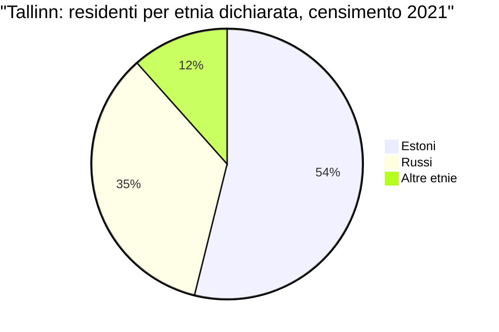

### I concorrenti sono più grandi, ma quasi tutti guadagnano poco o perdono

Il mercato ha tre livelli. Al vertice ci sono i panifici industriali, guidati da Eesti Pagar. In mezzo le catene di caffè-panetteria. In basso una nicchia di piccoli laboratori, spesso russofoni, che vendono torte intere su ordinazione. Il dato che accomuna i primi due livelli è la **redditività bassa o negativa**: Leibur, Pagaripoisid, Café Lyon, Rõngu Pagar e Marmiton hanno chiuso l'ultimo esercizio in perdita. **Pirogoff fattura circa un ventisettesimo di Pagaripoisid e circa un ottocentesimo di Eesti Pagar.**

| Azienda | Ricavi ultimo anno | Anno | Utile/perdita | Note | Fonte | Affid. |
|---|---|---|---|---|---|---|
| Eesti Pagar AS | €106,84 mln | 2025 | utile €1,27 mln (anno incerto) | 2024: €100,97 mln; investe €30 mln a Paide | [Inforegister](https://www.inforegister.ee/en/10080750-EESTI-PAGAR-AS/); [Tööstusuudised](https://www.toostusuudised.ee/uudised/2026/04/06/eesti-pagar-investeerib-laiendusse-ja-robotlattu-30-miljonit-eurot-juht-turuolukorrast-hinnad-kindlasti-tousevad) | S |
| Orkla Eesti AS (Kalev) | €94,09 mln | 2025 (previsione) | n.d. | circa 57,7% dolciumi | [Inforegister](https://www.inforegister.ee/en/11267031-ORKLA-EESTI-AS/) | S |
| Leibur AS | €29,94 mln | 2025 | −€3,58 mln (2024) | pane | [Krediidiraportid](https://krediidiraportid.ee/leibur) | S |
| Fazer Eesti OÜ | €11,49 mln | anno non indicato | n.d. | 82 addetti; dato incoerente | [Inforegister](https://www.inforegister.ee/en/10057691-FAZER-EESTI-OU/) | S |
| Eesti Leivatööstus AS (ex Hagar) | €9,09 mln | 2024 | margine circa 8% | | [Krediidiraportid](https://krediidiraportid.ee/eesti-leivatoostus) | S |
| Rõngu Pagar OÜ | €6,93 mln | 2025 | −€82.497 | | [Tööstusuudised](https://www.toostusuudised.ee/majandustulemused/2026/06/03/rongu-pagar-kasvatas-kaivet-kuid-suure-laienemise-aasta-loppes-kahjumiga) | S |
| Marmiton AS | €4,33 mln | 2025 | risultato operativo −€81.151 | | [Tööstusuudised](https://www.toostusuudised.ee/majandustulemused/2026/05/20/orklalt-poltsamaa-tehase-ule-votnud-hulgikaupmehe-pagaritoostus-langes-mullu-kahjumisse) | S |
| Lõuna Pagarid AS | €4,07 mln | 2023 | €68.571 | 65–70 addetti | [Võrumaa Teataja](https://vorumaateataja.ee/koik-uudised/uudised/34492-eesti-parim-pagaritoode-2025-on-louna-pagarite-kaerasai-johvikatega) | S |
| Esperan OÜ (Reval Café) | €8,31 mln | 2024 | n.d. | 13 caffè; previsione 2025 €8,99 mln | [e-Krediidiinfo](https://www.e-krediidiinfo.ee/10711179-ESPERAN%20O%C3%9C) | S |
| Pagaripoisid OÜ | €3,55 mln | 2025 | −€274.173 (2024) | 9 caffè; 68 addetti (T2 2026) | [SSB](https://ssb.ee/10381865-PAGARIPOISID-OU/meedia-arvamuslood) | S |
| Saiakohvik OÜ (Café Lyon) | €1,27 mln | 2024 | −€13.983 | | [Infopank](https://www.infopank.ee/ettevote/3283/saiakohvik-ou) | S |
| Gourmet Coffee Kadriorg OÜ | €0,99 mln | 2024 | n.d. | 20 addetti | [Inforegister](https://www.inforegister.ee/en/14886734-GOURMET-COFFEE-KADRIORG-OU/) | S |
| **OÜ Pirogoff.ee** | **€0,13 mln** | 2025 | **−€7.216** | 3–4 banconi | [e-Äriregister](https://ariregister.rik.ee/est/company/14638232/O%C3%9C-Pirogoff.ee) | V |

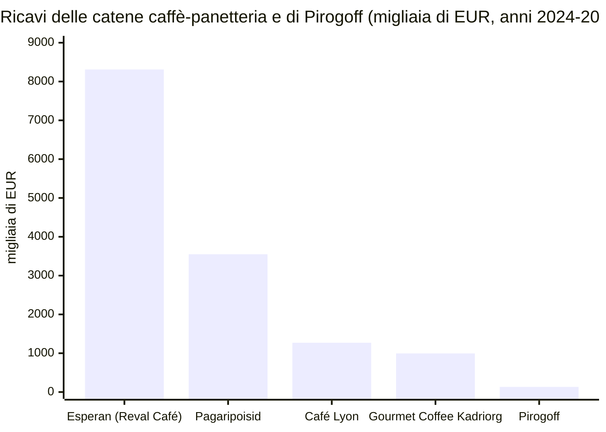

I concorrenti diretti sono piccoli laboratori di torte intere su ordinazione, quasi tutti senza bilanci reperibili. **Nikolay Bar-buffeé** (Gonsiori 10) è il riferimento premium. Vende torte da 1 kg e da 1,5 kg con "60% di ripieno, 40% di pasta", accetta ordini fino alle 20:00 per il giorno dopo e consegna gratis in città da 4 torte in su ([nikolay.ee](https://nikolay.ee/?lang=)). Un gruppo Facebook russofono di consigli, nel 2026, indica Nikolay quando si chiede dove trovare buone torte ([gruppo Facebook](https://www.facebook.com/groups/advice.search/posts/3490629967768651/)). **NOSTALGIA** è il riferimento economico ([pagarnostalgia.ee](https://pagarnostalgia.ee/vipetska/solenie-pirogi-1kg-12kg/pirog-s-mjasom-i-risom/)). **Kolobok** è primo su Google per "заказать пироги Таллинн" e ha 3.862 valutazioni su Bolt ([kolobok.ee](https://kolobok.ee/pie-order.html)). **Sju Cake House** punta sui video brevi: circa 5 post a settimana, per lo più Reels ([Instagram Sju](https://www.instagram.com/sjucakehouse/)). Completano il quadro Ahjupala (forno a legna, Kari 1) e Grenka.

### Prezzi: Pirogoff è nella fascia medio-alta delle torte intere

| Prodotto | Venditore | Prezzo | €/kg | Fonte | Affid. |
|---|---|---|---|---|---|
| Torte intere salate e dolci, 0,9–1 kg | Pirogoff | €19–33 | €21–37 | [pirogoff.ee](https://pirogoff.ee/) | V |
| Tacchino e prugne, 1 kg / 1,5 kg | Nikolay | €32 / €48 | €32 | [nikolay.ee](https://nikolay.ee/?lang=) | V |
| Zucchine €30/kg; carne €38/kg | Nikolay | €30–38 | €30–38 | [nikolay.ee](https://nikolay.ee/?lang=) | S |
| Torta salata da 1–1,2 kg | NOSTALGIA | €20–25 | €16,7–25 | [pagarnostalgia.ee](https://pagarnostalgia.ee/vipetska/solenie-pirogi-1kg-12kg/pirog-s-mjasom-i-risom/) | S |
| Torta intera da 1 kg (cavolo, carne, salmone) | Grenka | €18–32 | €18–32 | [grenka.ee](https://www.grenka.ee/rus-pies) | S |
| Torte salate e dolci (peso non indicato) | Ahjupala | €14–22 | n.d. | [ahjupala.ee](https://ahjupala.ee/soolased-pirukad/) | S |
| Pirukas singolo (consegna) | Pirukapunkt su Wolt | €3,20–3,90 al pezzo | n.d. | [Wolt Pirukapunkt](https://wolt.com/en/est/tallinn/venue/pirukapunkt1) | S |
| Pirukas singolo (Città Vecchia) | III Draakon, Municipio | €3–3,50 al pezzo | n.d. | [Kolmas Draakon](https://www.kolmasdraakon.ee/food/) | S |

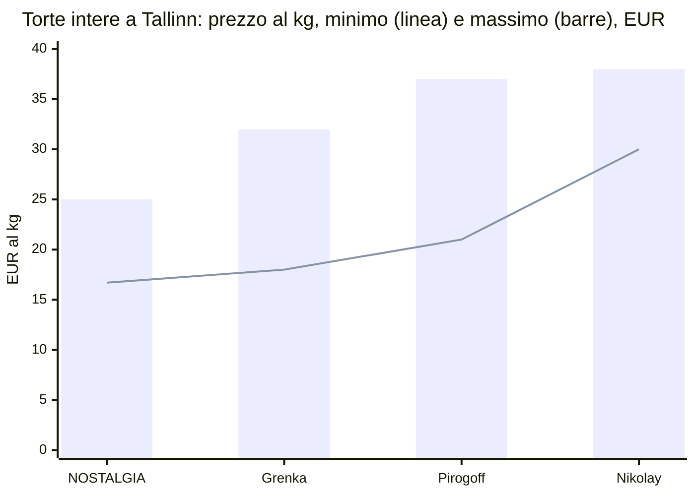

Il prezzo di Pirogoff è quindi **allineato a Nikolay e sopra i laboratori economici**. Nessuno dei concorrenti analizzati comunica però le leve di differenziazione di Pirogoff: due impasti a scelta, ripieni europei e trasparenza completa su valori nutrizionali e allergeni. Anche le condizioni di consegna sono una leva competitiva. Pirogoff consegna gratis sopra €50; NOSTALGIA chiede €6 con gratuità intorno a €40; Nikolay consegna gratis da 4 torte; Kolobok applica tariffe di €5–7 per quartiere con 24 ore di preavviso ([kolobok.ee](https://kolobok.ee/pie-order.html)).

### Marketing digitale: il marchio è invisibile proprio dove i concorrenti sono forti

L'account **@pirogoff_tln** ha **183 follower e 43 post**. **L'ultimo post è del 17 dicembre 2023**, circa 33 mesi fa, e il profilo non è impostato come account aziendale. La bio dice solo "In Pie We Trust" e il nome visualizzato è vuoto ([Instagram](https://www.instagram.com/pirogoff_tln/)). Il coinvolgimento è stato comprato con i concorsi: **344 dei 352 commenti** del campione stanno su un unico post-concorso ([post concorso](https://www.instagram.com/p/CbiL4pOtyUj/)). Senza i concorsi la media è di circa 14 like e quasi zero commenti. Facebook ha **955 follower**, pubblica 2–3 post l'anno e mostra ancora Ülemiste come indirizzo ([Facebook](https://www.facebook.com/Pirogoff.ee)). Non esistono account TikTok, VK o Telegram. Cercando "pirogoff" su Instagram si trovano panetterie omonime molto più seguite in Kazakistan e Russia, per esempio @pirogoff_almaty con 8.464 follower ([Instagram](https://www.instagram.com/pirogoff_almaty/)).

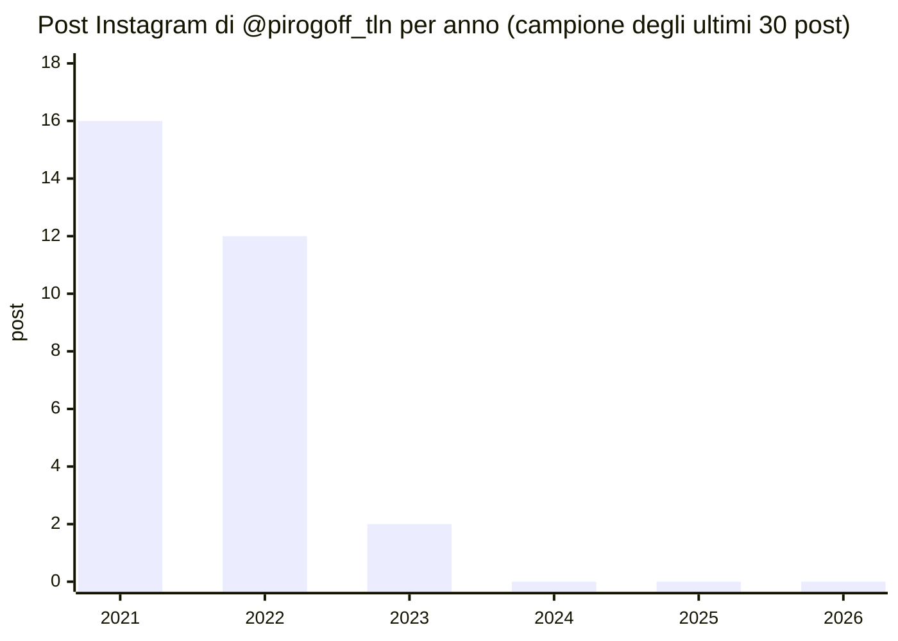

Il sito ha basi solide (carrello, varianti, consegna su fascia oraria, Google Analytics e Meta Pixel) ma è pieno di difetti che costano visibilità e fiducia ([pirogoff.ee](https://pirogoff.ee/); [PageSpeed](https://pagespeed.web.dev/analysis?url=https%3A%2F%2Fpirogoff.ee%2F)). Sul piano tecnico il test mobile di PageSpeed dà 88 di prestazioni, con un LCP di 3,5 s e 484 KiB di JavaScript inutilizzato, e ogni scheda prodotto contiene un **dump di debug PHP nascosto** (229 blocchi nella sola home page). Sul piano SEO le pagine russe hanno il **tag canonical sbagliato** e puntano alle pagine estoni, molte meta description mancano o sono copiate da altri prodotti, lo snippet Google indica ancora una consegna a €5 anziché €6 e manca un markup LocalBusiness con indirizzi e orari. I contenuti hanno refusi ("Otsukorv" invece di "Ostukorv", carrello), l'acqua indicata come allergene ("Allergeenid: vesi") e un attributo dell'impasto in russo ("Тесто") sulle pagine estoni. I termini dell'e-shop stanno su Google Docs ([termini](https://docs.google.com/document/d/1ELkBJGPQwLXhFVhqbn0kWnEZmmADmaeC/edit)) e **non c'è un'informativa privacy**: la pagina [/privaatsuspoliitika/](https://pirogoff.ee/privaatsuspoliitika/) restituisce 404, un tema GDPR da sottoporre a un legale. Manca infine una versione inglese.

Il quadro SEO è netto. Il sito è **primo su Google per "pirukad Tallinn" e "пироги Таллинн"**, ma **non compare per nessuna ricerca transazionale** ("pirukate tellimine Tallinn", "pirukad kohaletoimetamine Tallinn", "заказать пироги Таллинн", "pies Tallinn") e nemmeno per il proprio nome, dove compaiono invece il chirurgo ottocentesco Pirogov e annunci di lavoro.

| Ricerca su google.ee (01/10/2026) | Posizione di pirogoff.ee | Chi si posiziona | Affid. |
|---|---|---|---|
| pirukad Tallinn | **1°** | narvakohvik.ee, nikolay.ee, grenka.ee | V |
| пироги Таллинн | **1°** (/ru/) | gruppo Facebook che consiglia Nikolay, sjucakehouse.ee | V |
| pirukate tellimine Tallinn | Assente dai primi 9 (solo il profilo Instagram al 2°) | cafelyon.ee 1°, Wolt Kringel, Nikolay | V |
| pirukad kohaletoimetamine Tallinn | Assente dai primi 11 | Annuncio a pagamento Pelm Deli; Sju, Gulliver, Nikolay | V |
| заказать пироги Таллинн | Assente dai primi 11 | kolobok.ee 1°, MomBakery, Nikolay | V |
| pies Tallinn | Sito assente; la pagina Wolt di Mustakivi è 6ª | Tripadvisor, Wolt Pirukapunkt | V |
| Pirogoff (marchio) | Sito assente dai primi 8 | visitharku.com, CV Keskus, articolo sul chirurgo Pirogoff | V |

Fonti: [pirukad Tallinn](http://www.google.ee/search?q=pirukad+Tallinn&hl=et); [пироги Таллинн](http://www.google.ee/search?q=%D0%BF%D0%B8%D1%80%D0%BE%D0%B3%D0%B8+%D0%A2%D0%B0%D0%BB%D0%BB%D0%B8%D0%BD%D0%BD); [pirukate tellimine Tallinn](http://www.google.ee/search?q=pirukate+tellimine+Tallinn&hl=et); [pirukad kohaletoimetamine Tallinn](http://www.google.ee/search?q=pirukad+kohaletoimetamine+Tallinn&hl=et); [заказать пироги Таллинн](http://www.google.ee/search?q=%D0%B7%D0%B0%D0%BA%D0%B0%D0%B7%D0%B0%D1%82%D1%8C+%D0%BF%D0%B8%D1%80%D0%BE%D0%B3%D0%B8+%D0%A2%D0%B0%D0%BB%D0%BB%D0%B8%D0%BD%D0%BD); [pies Tallinn](http://www.google.ee/search?q=pies+Tallinn); [Pirogoff](http://www.google.ee/search?q=Pirogoff&hl=et).

L'unico marketing attivo è a pagamento. Dal **25 marzo 2024** Pirogoff fa girare quasi senza interruzioni **annunci di catalogo dinamici (DPA)** su Meta, con testi copiati dalla pagina consegne. A luglio–agosto 2026 ha aggiunto una promozione "−20% sugli ordini online da €100". Il 1° ottobre 2026 erano attivi due annunci ([Meta Ad Library](https://www.facebook.com/ads/library/?active_status=all&ad_type=all&country=EE&q=Pirogoff&search_type=keyword_unordered&media_type=all)). Questi annunci portano traffico su un sito con refusi, senza recensioni né testimonianze. Fra i concorrenti diretti solo Nikolay faceva pubblicità su Meta, in estone e russo ([Meta Ad Library "пироги"](https://www.facebook.com/ads/library/?active_status=active&ad_type=all&country=EE&q=%D0%BF%D0%B8%D1%80%D0%BE%D0%B3%D0%B8&search_type=keyword_unordered&media_type=all)). Su Google l'unico annuncio visto nelle ricerche di torte era di **Pelm Deli**. Le parole chiave transazionali sono quindi un'opportunità a bassa concorrenza, da validare con Keyword Planner.

| Marchio | Follower Instagram | Recensioni Google (voto) | Wolt (0–10) | Bolt Food (n. valutazioni) | Affid. |
|---|---|---|---|---|---|
| **Pirogoff** | **183** (fermo dal 2023) | **0** | 4 sedi, nessun punteggio | **Non presente** | V |
| Nikolay Bar-buffeé | non trovato (Facebook 21.495 like) | 1.981 (4,7) | 9,2 | 4,82 (17.828) | V |
| Sju Cake House | 767 | 71 (4,8) | 9,6 | 4,92 (1.911) | V |
| Kolobok | non trovato | n.d. | – | 4,74 (3.862) | V |
| Pagaripoisid | 1.058 | 799 (4,5) | 9,6–9,8 | 4,74–4,92 (518–2.291 per sede) | V |
| Reval Café | 2.682 | 1.970 (4,5) | 9,0–9,4 | 4,58–4,78 (327–1.353) | V |
| Café Lyon | 1.158 | 947 (4,4) | – | 4,72 (2.279) | V |
| RØST | 8.054 | 3.103 (4,8) | – | – | V |
| Kalamaja Pagarikoda | 1.011 | 1.020 (4,7) | – | – | V |
| Café Narva | 2.317 | 1.764 (4,3) | – | – | V |
| Lille Pagariäri | 480 | 29 (4,7) | 8,4 | 4,61 (90) | V |
| Pirukapunkt | non trovato | 41 (4,9) | 9,8 | – | V |
| Osseetia Pirukad | 360+ | n.d. | – | – | S |

Fonti: [Instagram Pirogoff](https://www.instagram.com/pirogoff_tln/); [Google Maps Nikolay](https://www.google.com/maps/search/?api=1&query=Nikolay%20Bar-buffe%C3%A9); [Google Maps Sju](https://www.google.com/maps/search/?api=1&query=Sju%20Cake%20House&query_place_id=ChIJd8_7f8SVkkYREXV-XOyTclA); [Instagram Pagaripoisid](https://www.instagram.com/pagaripoisid/); [Instagram Reval Café](https://www.instagram.com/reval_cafe/); [Instagram RØST](https://www.instagram.com/rostpagar/); [Instagram Lille](https://www.instagram.com/lillepagar/); [Wolt Pirukapunkt](https://wolt.com/en/est/tallinn/venue/pirukapunkt1/collections/popular); [Bolt Food](https://food.bolt.eu/en-US/). Per le catene, voto Google e numero di recensioni si riferiscono a una sola sede.

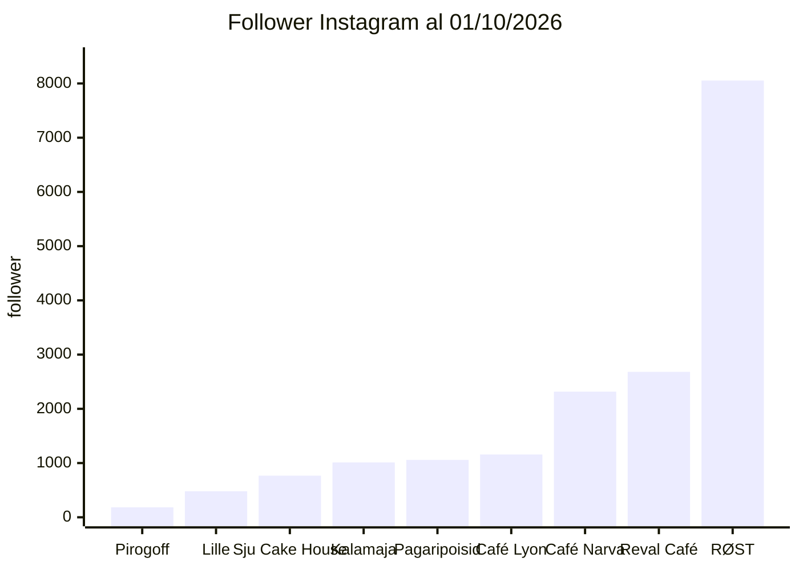

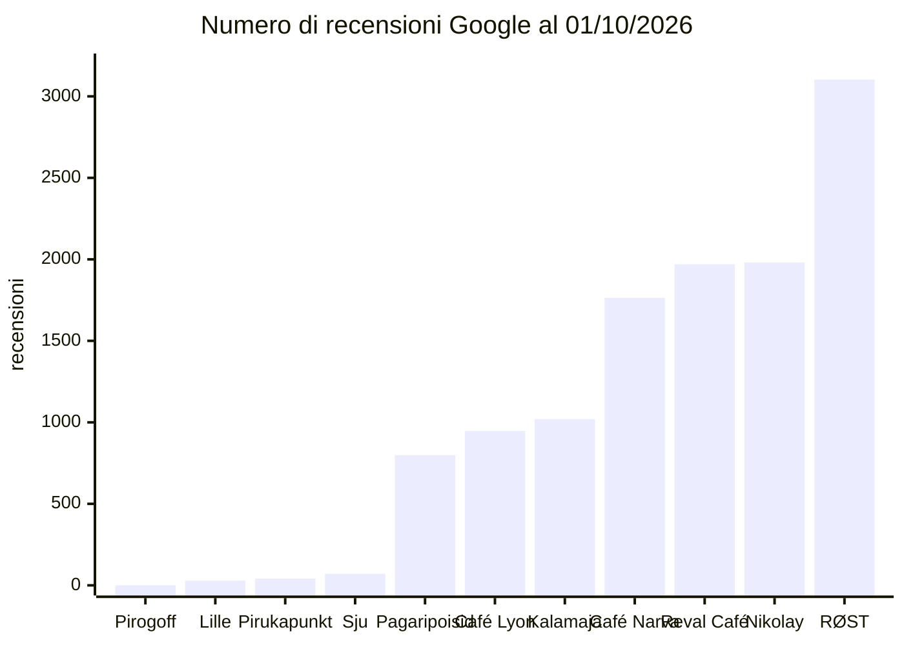

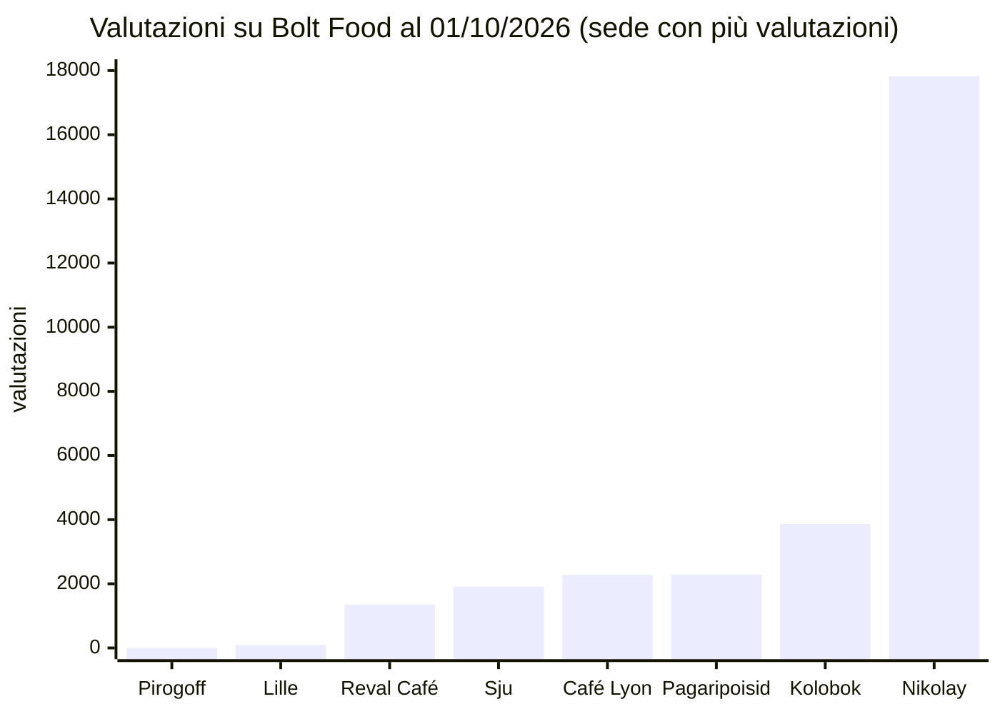

Il posizionamento del marchio è coerente nella sostanza (torte intere fatte a mano, ripieno generoso, "Reegel nr 1 – ära koonerda täidisega", cioè "regola n. 1: non risparmiare sul ripieno") ma incoerente nell'espressione ([pirogoff.ee/meist](https://pirogoff.ee/meist/)). Lo slogan cambia lingua e messaggio a seconda del canale: "In Pie We Trust" su Instagram, "Käsitsi ja armastusega tehtud pirukad!" su Facebook e Wolt, "Pagarikoda Tallinnas" sul sito. La promessa di "esotico e premium" del sito è contraddetta dal tema WooCommerce standard (Storefront) e dagli errori. Il nome "Pirogoff" ha un suono russo ed è condiviso con panetterie in Russia e Kazakistan: è una fragilità latente. Non serve per forza cambiarlo, ma conviene accompagnarlo con un descrittore estone come **"Pirogoff · Tallinna pagarikoda"** ("laboratorio di panetteria di Tallinn") ed evitare caratteri che imitano il cirillico e ornamenti folk russi. Qualsiasi rebranding va prima testato sui consumatori.

## 5. Le idee del cliente: giuste nella direzione, da riordinare nella sequenza

| Idea del cliente | Verdetto | Condizione decisiva | Priorità |
|---|---|---|---|
| Attivare Wolt e Bolt Food | Wolt è già attivo e va **sistemato**; Bolt va **riattivato** | Menu completo, valutazioni, offerte "festa" e bundle; commissioni del 20–30% | **Alta, subito** |
| Spostarsi in una location ad alto passaggio (Balti Jaama Turg, Città Vecchia) | Sì, ma come **test temporaneo**; Viru Keskus è il candidato più forte | Apertura al mattino, porzioni a €3–4, nessun contratto lungo prima dei dati | Media, 1–6 mesi |
| Mini-torte da passeggio e fette | **Sì: è la leva più urgente** | Ricette adattate da standardizzare; prezzo €3–4 | **Alta** |
| Abbandonare i negozi per il B2B | **B2B sì, abbandono totale no** | Classificazione PTA, durata validata, capitale circolante | Alta (progetto pilota) |
| Nuovo packaging tradizionale | **Finestra sì; rosso-oro-nero e corsivo rosso no** | Conformità al regolamento UE sugli imballaggi (PPWR) e limiti PFAS | Media |
| Analisi tecniche e di laboratorio | **Indispensabili per il B2B** | Circa €1.500–2.500 per 8–10 referenze (E) | **Alta** |
| Sistema di vendita B2B completo | Sì, **a fasi** | Schede tecniche, codici GS1, EDI per le catene | Media-alta |
| Continuare il B2C | **Sì, ridisegnato** | Chiudere i banconi che perdono; il digitale diventa il canale principale | **Alta** |

### Wolt e Bolt Food: non vanno attivati, vanno sistemati e riattivati

L'idea parte da un presupposto inesatto. **Pirogoff è già su Wolt con quattro sedi**, che però non mostrano alcun punteggio. Questo fa pensare a pochi ordini. Ogni sede ha in vetrina solo 5–9 torte delle 31–33 a catalogo e quella di Tiskre era offline al momento della verifica ([Wolt Mustakivi](https://wolt.com/et/est/tallinn/venue/pirogoff-mustakivi); [Wolt Tiskre](https://wolt.com/et/est/tallinn/venue/tiskre-prisma-pirogoff)). Su **Bolt Food Pirogoff non c'è più**. Rientrare costa poco: Bolt dichiara "nessun costo di attivazione", pagamenti settimanali e avvio in circa una settimana ([Bolt Food partner](https://partners.food.bolt.eu/), S). Neanche Wolt chiede costi di adesione, abbonamenti o penali di uscita; il tablet costa €100–218 più IVA ed è facoltativo ([Wolt merchant FAQ](https://merchant.wolt.com/en/est/faq), S). **Wolt Ads** si paga solo a ordine effettuato ([Wolt Ads](https://explore.wolt.com/en/est/wolt-ads/restaurants-and-stores), S). Le commissioni pubblicate sono vecchie, del 2019–2020: i ristoratori parlano di **20–30%**, e Wolt applicava il **25% sulle consegne e il 20% sul ritiro**. I locali coprivano anche **metà del costo** delle campagne "consegna gratuita" ([ERR](https://news.err.ee/1098962/restaurants-teaming-up-against-food-delivery-services-price-policies); [ERR](https://www.err.ee/972390/tasuta-lounaid-pole-olemas-restoranid-maksavad-toidu-kullerveo-eest-rasvaseid-tasusid); [ERR](https://www.err.ee/1069813/wolti-tasuta-kojuveo-kulust-poole-peavad-tasuma-toidukohad), S). La commissione di Bolt Food si negozia. Il "25% a Tallinn" che circola online è la commissione degli **autisti** di Bolt, non quella dei ristoranti ([Bolt](https://bolt.eu/en/support/articles/4405161984786/)).

| Prodotto su piattaforma | Prezzo | Commissione al 25% | Contributo stimato per unità | Affid. |
|---|---|---|---|---|
| Torta intera | €28 | circa €7 | €8–11 | E |
| Pirukas singolo (riferimento Pirukapunkt) | €3,30 | circa €0,83 | €1,10–1,40 | E |

Il calcolo mostra che **sulle piattaforme conviene vendere torte intere e pacchetti "festa"**; i pezzi singoli hanno senso solo come aggiunta a un carrello più grande. Il piano per le piattaforme consiste nel ridurre le sedi Wolt a quelle davvero operative, pubblicare il catalogo completo con foto professionali, inserire nella scatola un invito a lasciare una valutazione, creare pacchetti "festa" e "ufficio", riattivare Bolt e testare Wolt Ads per 4–6 settimane misurando il costo per ordine. Anche l'orario 12–21 va rivisto, perché esclude colazione e pranzo anticipato. Il ritiro costa meno della consegna (20% contro 25%): il click-and-collect presso i banconi riduce le commissioni e porta clienti al punto vendita.

### Spostarsi dove passa la gente: test sì, contratti lunghi no

Per numero di visite il candidato più forte è **Viru Keskus (circa 15 milioni l'anno, oltre 30.000 al giorno)**. È accanto al terminal degli autobus, al nodo dei tram e alla Città Vecchia, ed è l'unico luogo che intercetta insieme pendolari, studenti, turisti e chi fa acquisti ([Viru Keskus](https://virukeskus.com/en/about-viru-keskus), S). **Balti Jaama Turg** dichiara oltre **5,1 milioni di visite l'anno**, l'area street food più grande di Tallinn (più di 40 banchi e ristoranti) e fino a 300 venditori in alta stagione ([Astri – BJT](https://astri.ee/grupp/en/astri-keskkonnad/tule-kauplema/bjt/), S). Il mercato è unito alla stazione principale del Paese, da cui partono tutti i treni (Elron ha trasportato **7,66 milioni di passeggeri nel 2025** sull'intera rete), ed è accanto a Telliskivi, che conta oltre 1,5 milioni di visitatori ([ERR](https://news.err.ee/1610100877/new-riga-rail-link-boosts-elron-s-baltic-passenger-numbers); [Telliskivi](https://telliskivi.cc/en/about-eng/), S). Il dato chiave è che Balti Jaama Turg **affitta micro-spazi da 1,2 × 1,2 m per periodi da 1 a 30 giorni**: basta scrivere a baltijaamaturg@astri.ee indicando ragione sociale, codice di registro, contatti e prodotti ([Astri Zendesk](https://astri.zendesk.com/hc/et/articles/115003293485-Mikropinnad-Balti-Jaama-Turul), S). I canoni non sono pubblicati.

| Luogo | Visite o passeggeri annui | Anno del dato | Nota | Affid. |
|---|---|---|---|---|
| Viru Keskus | circa 15 mln (oltre 30.000 al giorno) | n.d.; fatturato del centro circa €130 mln | terminal bus, tram, Città Vecchia | S |
| Ülemiste Keskus | circa 7,3–7,9 mln (20.000 al giorno, 660.000 al mese) | record 2024; 2025 −3–4% e in perdita | Pirogoff ci era presente e ha chiuso | S |
| Kristiine Keskus | 7,1 mln | dato vecchio (circa 2013–2019) | Pirogoff ci era presente e ha chiuso | S |
| Rocca al Mare | 5,5 mln | circa 2015 | | S |
| Balti Jaama Turg | oltre 5,1 mln | anno non indicato (dato del proprietario) | micro-spazi da 1 a 30 giorni | S |
| Telliskivi Loomelinnak | oltre 1,5 mln | anno non indicato | più di 800 eventi l'anno | S |
| Elron (rete ferroviaria) | 7,66 mln di passeggeri | 2025 | dato di rete, non della sola stazione | S |
| Aeroporto di Tallinn | 3,49 mln di passeggeri | 2025 | | S |
| Visitatori stranieri a Tallinn | 3,42 mln | 2025 | rilevati tramite telefoni cellulari | S |
| Crocieristi | circa 190.000 (+25,3%): T1 0, T2 67.000, T3 97.000, T4 27.000 | 2025 | fortemente stagionali | S |

Fonti: [Viru Keskus](https://virukeskus.com/en/about-viru-keskus); [Kapitel](https://kapitel.ee/retail/viru-keskus/); [Ülemiste FAQ](https://www.ulemiste.ee/kkk/); [Ülemiste, intervista al direttore](https://www.ulemiste.ee/ulemiste-keskuse-juht-laheb-raskemaks-aga-investeeringud-piirkonda-peavad-jatkuma/); [Wikipedia: Kristiine Centre](https://en.wikipedia.org/wiki/Kristiine_Centre); [Kaubandus.ee: Rocca al Mare](https://www.kaubandus.ee/uudised/2015/06/18/rocca-al-mare-tahab-saada-eesti-suurimaks-keskuseks); [Tallinn Airport](https://airport.ee/en/tallinn-airports-2025-financial-results-strong-profitability-and-remarkable-revenue-growth/); [Tallinn.ee](https://www.tallinn.ee/en/news/tallinns-international-tourism-breaks-records-grows-and-diversifies); [Inderes: Tallinna Sadam](https://www.inderes.fi/en/releases/as-tallinna-sadam-operational-volumes-for-2025-full-year-and-q4).

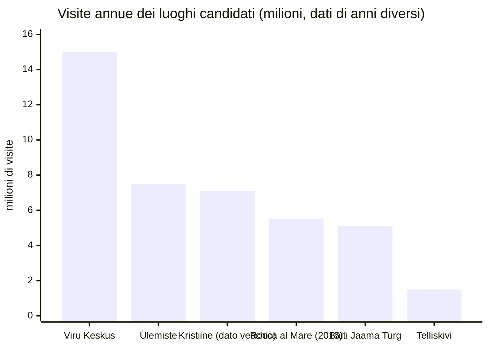

La **Città Vecchia** è il contesto meno adatto per un negozio fisso. Lì i turisti contano più dei residenti e la domanda è molto stagionale: i crocieristi sono zero nel primo trimestre e circa l'85% arriva fra aprile e settembre. I canoni richiesti per piccole unità vanno da €11,5 a €28,3 al m² al mese, e il **prezzo al m² è più alto proprio per gli spazi più piccoli**. Il concorrente di riferimento, III Draakon nel Municipio, vende pirukad a **€3–3,50**. Dehors e attrezzature esterne richiedono un'autorizzazione del dipartimento del patrimonio culturale ([Tallinn.ee](https://www.tallinn.ee/en/services/granting-permits-installing-outdoor-cafeterias-small-equipment-or-outside-advertisements-tallinn-old)). In Città Vecchia funzionano meglio i formati stagionali: le fiere cittadine costano **€48 al giorno per una tenda di 3×3 m e €60 al giorno per il food truck** (tariffe 2025, probabilmente quelle degli Old Town Days) ([delibera comunale](https://vanalinnapaevad.ee/wp-content/uploads/2025/05/T-30-1_25_35_lisa_1.pdf), S). Il mercatino di Natale di Raekoja plats si è tenuto dal 21 novembre al 27 dicembre 2025 ([Puhka Eestis](https://puhkaeestis.ee/et/tallinna-jouluturg-2111-27122025), S), e il Comune sta valutando se gestirlo direttamente o metterlo a gara, quindi le condizioni 2026 possono cambiare ([ERR](https://www.err.ee/1609831014/tallinn-vaeb-kas-korraldada-edaspidi-jouluturgu-ise-voi-teha-hange), S).

| Unità in Città Vecchia (annunci kv.ee, data non visibile) | m² | €/mese | €/m² al mese | Affid. |
|---|---|---|---|---|
| [Rüütli](https://www.kv.ee/valja-uurida-multifunktsionaalse-kasutusalaga-arip-3033606.html) | 15 | 425 | 28,3 | S |
| [Pärnu mnt 4](https://www.kv.ee/3601127) | 25,6 | 600 | 23,4 | S |
| [Viru 21](https://www.kv.ee/uurile-anda-unikaalne-aripind-tallinna-vanalinna-s-3304210.html) | 167 | 3.000 | 18,0 | S |
| [Lai 49](https://www.kv.ee/uurile-anda-kogu-vajaliku-sisustusega-restoran-voi-3044470.html) | 145 | 2.200 | 15,2 | S |
| [Väike-Karja 5](https://www.kv.ee/uurile-anda-vaga-hea-asukohaga-aripind-vanalinnas-3251770.html) | 104 | 1.200 | 11,5 | S |
| Riferimento: centri commerciali prime a Tallinn | – | – | 23–45 (sfitto 2,2%) | S |
| Riferimento: vie commerciali prime | – | – | 18–33 | S |

Fonte dei riferimenti: [Colliers Q2 2026](https://www.colliers.com/en-lv/countries/latvia/reports/2026/q2-2026-baltic-property-snapshot).

L'economia di un chiosco va valutata con ipotesi esplicite (E). Un chiosco di 10 m² a €35 al m² costa circa €350 al mese di canone base, a cui si aggiungono le spese condominiali, non pubbliche. La voce che pesa davvero è il personale: circa 2 FTE per coprire 11–12 ore al giorno. Con un contributo di circa €2 per porzione a €3,50, **ogni €1.000 di costi fissi mensili richiede circa 500 porzioni in più al mese, circa 17 al giorno**. Per il costo di allestimento di un chiosco non esistono dati estoni: si stimano "alcune decine di migliaia di euro", da verificare con 2–3 preventivi di arredatori di negozi. Ne deriva una sequenza precisa. Prima un **test di 2–4 settimane in un micro-spazio a Balti Jaama Turg** con l'offerta caffè e porzione per i pendolari del mattino e torte intere da portare a casa la sera, più il **mercatino di Natale** o una fiera di quartiere. Solo dopo, con i dati di vendita giornalieri, un chiosco fisso, con Viru Keskus o Balti Jaama Turg come candidati. Ülemiste va esclusa: Pirogoff ci ha già chiuso e il centro ha perso visite nel 2025.

### Nuovi formati: la porzione da passeggio è la mossa più urgente

L'idea delle mini-torte e delle fette è la più importante del piano, perché risolve il problema centrale emerso dalla due diligence: **a chi passa davanti al bancone manca un prodotto d'ingresso**. Il modello è Stolle: **1 kg diviso in 8 porzioni** ([Stolle](https://msk.stolle.ru/blog/74)). A Pirogoff basta pre-tagliare in 8 fette le torte intere esistenti. A €27 la torta intera corrisponde a circa **€3,38 a fetta**, quindi una fetta a €3,50–4,00 renderebbe di più al grammo della torta intera (E). Il prezzo sarebbe in linea con III Draakon (€3–3,50) e Pirukapunkt (€3,20–3,90). Il secondo formato è il *pirukas* individuale da mano, cioè il *pirozhok*. Qui la concorrenza è forte e banalizzata: R-Kiosk ha circa 90 punti vendita e punta su "street food e paste con ricette proprie" ([Wikipedia: R-kioski](https://en.wikipedia.org/wiki/R-kioski), S). La porzione di Pirogoff deve quindi essere **visibilmente artigianale e più ricca di ripieno**, coerente con la regola del marchio. I dati Nielsen confermano la tendenza: crescono i formati comodi, calano le paste tradizionali ([Tööstusuudised](https://www.toostusuudised.ee/majandustulemused/2026/07/16/leivaturg-kahanes-kuid-suurtootjad-kasvasid-eelise-andsid-eksport-ja-kulmutatud-tooted)). I tre pubblici indicati dal cliente vanno serviti con formati diversi. Ai **pendolari** servono porzioni salate con caffè fra le 7 e le 9, una fascia oggi scoperta perché i banconi aprono alle 12. Agli **studenti** servono porzioni sotto i €4: Tallinn University ha 7.237 studenti e per TalTech le stime vanno da 7.400 a 10.000 ([Wikipedia: Tallinna Ülikool](https://et.wikipedia.org/wiki/Tallinna_%C3%9Clikool); [TopUniversities](https://www.topuniversities.com/universities/tallinn-university-technology-taltech), S). Ai **nonni con nipoti** si rivolgono mini-torte dolci con ricotta e frutti di bosco. Il prodotto da mano richiede ricette diverse: più pasta in proporzione al ripieno e ripieni più asciutti, che non sgocciolino e reggano qualche ora in vetrina. Questo richiede la standardizzazione e i test di laboratorio descritti più avanti in questa sezione. Va colmato anche il vuoto vegano promesso dal sito.

### Abbandonare i negozi per il B2B: sì al B2B, no all'abbandono totale

Il B2B è la leva che può dare scala, e alcuni compratori lo cercano esplicitamente. **Selver** (agosto 2026) lavora con circa **200 piccoli produttori, "con spazio per molti altri"**, ed è disposta ad aiutarli, anche con referenze limitate ai negozi di una regione ([Kaubandus.ee](https://www.kaubandus.ee/sisuturundus/2026/08/13/vaiketootja-anna-endast-marku-selver-otsib-lettidele-uusi-kodumaiseid-maitseid), S). **Coop** dichiara di preferire i piccoli produttori locali ([Coop](https://www.coop.ee/kohalik), S). **Rimi**, che già ospita Pirogoff in due ipermercati, ha una procedura pubblica basata sull'invio di campioni al responsabile di categoria, che ricontatta se interessato ([Rimi](https://www.rimi.ee/ettevottest/hakka-rimi-koostoopartneriks), S); nelle aree "Talu Toidab" di tre suoi negozi trovano posto 85 piccoli produttori e circa 700 prodotti ([Bioneer](https://bioneer.ee/v%C3%A4iketootjad-pakuvad-eristuvaid-tooteid), S). **Maxima** pubblica i responsabili d'acquisto per categoria ([Maxima](https://www.maxima.ee/kontaktid-tarnijatele), S), mentre **Lidl** richiede standard internazionali di qualità e un percorso lungo ([Tööstusuudised](https://www.toostusuudised.ee/uudised/2024/04/15/lidl-eesti-juht-tootja-tee-meie-kaubamargi-alla-on-pikk-protsess-aga-eesti-toodetel-on-tugev-potentsiaal), S). Le catene però chiedono **capacità, affidabilità delle forniture, logistica e marketing**, non solo qualità ([Maaelu Postimees](https://maaelu.postimees.ee/3468053/vaiketootja-voistleb-poeketti-paasemisel-suurtega-vordsetel-tingimustel), S), e Selver (Selveri Köök) e Coop (Coop Kokad) hanno cucine proprie che fanno prodotti simili.

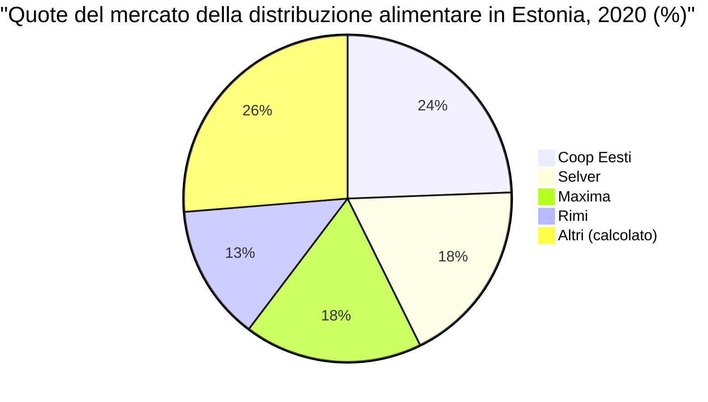

Fonte: [Wikipedia](https://en.wikipedia.org/wiki/List_of_supermarket_chains_in_Estonia) (S; dato del 2020, quote attuali non trovate).

Fra le caffetterie, **Reval Café** è un obiettivo plausibile, ma non per i dolci. Ha 13 caffè ([Puhka Eestis](https://puhkaeestis.ee/et/reval-cafe-kohvikud)), è gestita da Esperan OÜ e appartiene ai fratelli Rene e Anri Treifeldt ([Tartu Postimees](https://tartu.postimees.ee/3783841/pealinna-soogikohad-laienevad-tartusse)). Anri Treifeldt possiede anche **Reval Kondiiter OÜ**, che produce torte, mini-torte, biscotti e prodotti da forno freschi e surgelati ([Reval Kondiiter](https://revalkondiiter.ee/); [Inforegister](https://www.inforegister.ee/en/11449281-REVAL-KONDIITER-OU/), S). Con ogni probabilità i dolci si fanno in casa. La proposta più credibile per Reval Café è una **linea salata di pirog in porzioni**, magari a doppio marchio, da inserire nel menu della mattina, che già comprende pirukad e torte ([Reval Café](https://revalcafe.ee/en/), S). Caffeine appartiene a Reitan, che possiede anche R-Kiosk, quindi probabilmente acquista a livello di gruppo ([Postimees](https://majandus.postimees.ee/6419951/eestlastele-tuttav-kohvikukett-muudi-norrakatele), S). Gourmet Coffee è un operatore specializzato più piccolo (€0,99 mln di ricavi). Circle K cuoce ogni giorno in stazione prodotti semilavorati surgelati ([Circle K](https://www.circlek.ee/toiduvalik), S). Horeca Service distribuisce prodotti da forno surgelati a hotel, ristoranti e bar ([Horeca Service](https://horecaservice.ee/index.php/products/group/34/K%C3%BClmutatud+pagaritooted), S).

Sui margini non esistono dati specifici per i prodotti da forno estoni. Secondo Eesti Pank, il ricarico medio della distribuzione alimentare sul prezzo all'ingrosso è salito a circa il **26%** ([ERR](https://www.err.ee/1609823976/eesti-panga-hinnangul-on-juurdehindlus-selgelt-kasvanud-kaupmehed-ei-noustu), S). Le regole pratiche del settore, da verificare con i compratori (E), indicano che i supermercati chiedono il 25–40% di margine sui freschi a breve scadenza e che i bar moltiplicano il prezzo d'acquisto per 2,5–3,5. Una porzione venduta a €3,50–5,50 al banco va quindi ceduta all'ingrosso a circa **€1,20–1,80**. Dal 2021 la legge vieta di pagare i prodotti alimentari deperibili oltre **30 giorni** ([EPKK](https://epkk.ee/maksetahtaeg-toiduainete-tarnimisel-ei-tohiks-uletada-30-paeva/), S). Con un capitale circolante netto di €5.893, anche 30 giorni di crediti commerciali vanno finanziati. Un esempio aiuta a misurare il potenziale (E). Un cliente che compra 10 porzioni al giorno a €1,50, sei giorni su sette, vale circa **€4.700 l'anno**. Circa 8 clienti di questo tipo colmerebbero la distanza fra i ricavi 2025 e il picco del 2022 (€35.636).

Abbandonare del tutto il B2C sarebbe però un errore, per quattro ragioni. Il B2C incassa subito e al prezzo pieno. Dà al marchio la visibilità che il B2B deve poter mostrare. Il bancone di Tiskre è anche il laboratorio. E i dati di vendita al pubblico sono la prova di domanda che un compratore chiederà. La strada giusta è **chiudere i banconi che non si ripagano**, sulla base dei dati di vendita per punto che la direzione deve fornire, e tenere uno o due punti come vetrina e punto di ritiro.

### Il nuovo packaging: la finestra sì, il rosso-oro no

La proposta del cliente unisce un'ottima idea a un codice visivo rischioso. La **scatola opaca con finestra trasparente va tenuta**: lascia che la torta fatta a mano si venda da sola, ed è il segnale più forte della categoria. Il **rosso e oro serigrafati**, con il nero e il **corsivo rosso**, sono invece la tavolozza esatta della **Khokhloma**, la pittura su legno russa nata nella seconda metà del Seicento, con fiori, bacche e uccello di fuoco ([Wikipedia: Khokhloma](https://en.wikipedia.org/wiki/Khokhloma)). Il Centro nazionale "RUSSIA" la presenta come **"la lingua della cultura russa"** ([russia.ru](https://en.russia.ru/news/v-nc-rossiia-obieiasnili-pocemu-xoxloma-iazyk-russkoi-kultury)). Su una scatola chiamata "Pirogoff", in Estonia dopo il 2022, questo codice dice "souvenir russo". È proprio l'associazione da evitare con clienti estoni, gestori di centri commerciali e compratori della distribuzione, come mostra la polemica che ha colpito il produttore di carni Rannarootsi per una pubblicità con simboli ucraini ([bne IntelliNews](https://www.intellinews.com/estonian-meat-producer-rannarootsi-denies-anti-russian-messaging-in-grill-advert-456561/)). Anche le lettere bianche con contorno nero hanno un'aria pesante e datata (E). Gli estoni rispondono bene ai marchi che richiamano il patrimonio locale, come Kalev ([Lossi 36](https://lossi36.com/2025/11/03/packaging-patriotism-kalev-chocolate-and-estonias-mythic-self-image/)). La direzione raccomandata (E) prevede cartoncino kraft o opaco non plastificato e un solo colore d'accento ispirato all'artigianato baltico e nordico (rosso mirtillo rosso, marrone segale o blu fiordaliso), mai rosso, oro e nero insieme. Il decoro si riduce a una sola fascia ornamentale sottile di geometria tessile generica, evitando motivi riconoscibili come quelli di Muhu, patrimonio sensibile in Estonia. I caratteri sono un sans umanista o un serif moderno in inchiostro scuro, con il nome del prodotto in estone nel corpo più grande e russo e inglese più piccoli, come chiede la legge sulla lingua. Un piccolo riquadro racconta "pirukas – da *pir*, la festa – fatto a mano a Tallinn".

Le regole sono cambiate in agosto. Il **regolamento UE sugli imballaggi (PPWR, Reg. 2025/40) si applica dal 12 agosto 2026**, senza esenzione generale per le PMI ([Commissione europea](https://environment.ec.europa.eu/news/new-eu-rules-packaging-enter-application-2026-08-11_en); [Tanso](https://www.tanso.de/en/blog/ppwr-eu-packaging-regulation-explained)). Da quella data valgono **limiti ai PFAS** negli imballaggi a contatto con alimenti: 25 ppb per singolo PFAS, 250 ppb per la somma, 50 ppm di PFAS totali. Sono proprio i trattamenti antigrasso tipici dei cartoni da forno, e non c'è periodo transitorio ([Food Safety Magazine](https://www.food-safety.com/articles/11228-pfas-free-food-packaging-by-august-2026), S). Dal 2030 gli imballaggi dovranno rientrare nelle classi di riciclabilità A–C. Una finestra in PET incollata a un cartone plastificato è il tipo di materiale composito che rischia una classe bassa. Meglio una **finestra fustellata senza film o in cellulosa**, con dichiarazione di conformità del fornitore. Inoltre una scatola con finestra **non è ermetica**: l'atmosfera modificata per allungare la durata richiede vaschette termosaldate, quindi un formato diverso. Diversi fornitori estoni vendono scatole con finestra e stampano su misura: Pakendikeskus, EcoWay, Infigo, Print24, Multipack e Gemoss ([Pakendikeskus](https://www.pakendikeskus.ee/c/toiduainete-pakendid/koogikarbid-koogialused-toidukarbid); [EcoWay](https://ecoway.ee/); [Infigo](https://infigo.ee/tootekategooria/toiduainete-pakendid/); [Print24](https://print24.com/ee/pakendid/toidu-pakend)). Indicativamente (E), una scatola standard costa €0,10–0,40 e una stampata in piccola tiratura (1.000–5.000 pezzi) €0,30–1,00, più qualche centinaio di euro per la fustella. Prima di ordinare servono preventivi.

### Analisi di laboratorio e durata: chi le fa, come si fanno, quanto costano

**Il quadro regolatorio.** Dal 1° aprile 2021 l'Estonia richiede una **licenza di esercizio dell'Autorità per l'agricoltura e l'alimentazione (PTA, tegevusluba)** solo dove la impone il diritto UE, cioè soprattutto per gli stabilimenti che trattano prodotti di origine animale (Reg. 853/2004). Negli altri casi basta una **notifica di attività** ([agri.ee](https://www.agri.ee/uudised/homsest-joustuv-toiduseaduse-muudatus-lihtsustab-toidukaitlejate-tegevust), S). Un panificio che usa solo vegetali e ingredienti animali già trasformati da stabilimenti riconosciuti produce "prodotti composti" e non ha bisogno del riconoscimento 853/2004 ([guida CE](https://food.ec.europa.eu/system/files/2020-05/biosafety_fh_legis_guidance_reg-2004-853_en.pdf), S). Se invece Pirogoff trasforma carne o pesce crudi e rifornisce altre imprese oltre i limiti "marginali, locali e ristretti", serve la licenza. Quei limiti sono 100 kg a settimana oppure il 35% della produzione animale settimanale, entro 300 km ([PTA](https://pta.agri.ee/tarbijale-ja-eraisikule/toit/kodus-toidu-valmistamine-muugiks), S). Il registro delle imprese mostra **0 licenze e 0 notifiche** per Pirogoff ([e-Äriregister](https://ariregister.rik.ee/eng/company/14638232/O%C3%9C-Pirogoff.ee)), ma la PTA tiene un registro separato. **Lo stato di registrazione presso la PTA va confermato con la direzione.** Le etichette devono essere in estone e conformi al Reg. 1169/2011 ([Toiduseadus](https://www.riigiteataja.ee/akt/117112021020)). I valori nutrizionali si possono **calcolare** con il programma **NutriData** dell'Istituto per lo sviluppo della salute (TAI), riconosciuto come fonte ([Toiduteave](https://toiduteave.ee/margistamine/toitumisalane-teave/), S).

**Le nuove regole sulla Listeria.** Dal **1° luglio 2026** il Reg. (UE) 2024/2895 impone "assenza in 25 g" per tutta la durata del prodotto nei cibi pronti che favoriscono la crescita della Listeria, a meno che il produttore dimostri di restare sotto 100 ufc/g ([EUR-Lex](https://eur-lex.europa.eu/legal-content/EN/TXT/HTML/?uri=OJ%3AL_202402895), S). Un cibo pronto rientra fra quelli che **non favoriscono la crescita** se vale almeno una di queste condizioni: pH ≤ 4,4; aw ≤ 0,92; pH ≤ 5,0 insieme ad aw ≤ 0,94; **durata inferiore a 5 giorni** ([Reg. 2073/2005](https://eur-lex.europa.eu/eli/reg/2005/2073/oj/eng)). In pratica, **con una durata sotto i 5 giorni non serve un costoso challenge test**.

**Chi fa le analisi.** **LABRIS**, il laboratorio statale per alimenti (ex VTL) con sede a Tartu e filiali, ha il listino più completo, con un pacchetto per la dichiarazione nutrizionale a **€243,05 IVA esclusa** ([LABRIS](https://labris.agri.ee/toitumisalane-teave), S). Il **laboratorio centrale del Terviseamet** (Autorità sanitaria), a Tallinn, offre le analisi microbiologiche singole più economiche ([Terviseamet](https://www.terviseamet.ee/et/laborid/kesklabor/0-l-kesklabori-toiduanaluusid-staatiline), S). **TFTAK** (Tallinn, Akadeemia tee 15A) fa studi di durata, prove di imballaggio e test sensoriali su preventivo ([TFTAK](https://www.tftak.eu/et/about_us)). **BioCC** (Tartu) è accreditato ISO/IEC 17025 dal 2013 per analisi microbiologiche e chimiche ([BioCC](https://www.biocc.ee/en/bioccst)). **Eurofins Estonia** è un laboratorio ambientale che spedisce i campioni alimentari alla propria rete estera ([Eurofins](https://www.eurofins.com/contact-us/worldwide-interactive-map/estonia/eurofins-environment-testing-estonia/)).

| Analisi | LABRIS (€, IVA esclusa) | Terviseamet (€, IVA esclusa) | Affid. |
|---|---|---|---|
| Carica aerobica | 12,56 | 6,17 (30 °C) | S |
| Lieviti e muffe | 16,29 | 7,92 + 7,92 (separati) | S |
| Enterobacteriaceae | 14,57 | – | S |
| Coliformi / E. coli | – | 9,67 / 10,50 | S |
| L. monocytogenes, conta | 18,90 | – | S |
| L. monocytogenes, presenza in 25 g | 21,71 | – | S |
| Salmonella ≤ 25 g | 18,42 | disponibile, prezzo n.d. | S |
| S. aureus / B. cereus | – | 15,75 / 12,25 | S |
| pH | 8,45 | – | S |
| Attività dell'acqua (aw) | 12,81 (attribuzione incerta) | – | S |
| Pacchetto dichiarazione nutrizionale | 243,05 | – | S |
| Tampone di superficie per Listeria | – | 18,00–25,00 (5–8 giorni lavorativi) | S |

Fonti: [listino LABRIS](https://labris.agri.ee/node/2113/handbook/2/pdf); [Terviseamet](https://www.terviseamet.ee/et/laborid/kesklabor/0-l-kesklabori-toiduanaluusid-staatiline); [Terviseamet, tamponi](https://terviseamet.ee/labor/teenused/pinnaproovide-analuusid). I rapporti fra prezzi con e senza IVA indicano che alcune voci provengono da listini 2023–2025: i prezzi del 2026 vanno riconfermati.

| Voce del programma di validazione | Costo stimato | Base del calcolo | Affid. |
|---|---|---|---|
| Studio di durata per una ricetta refrigerata: 3 prelievi (giorno 0, giorno obiettivo, giorno obiettivo +1), ciascuno con carica aerobica, lieviti e muffe, Enterobacteriaceae e Listeria, più pH e aw una volta | circa €215 da LABRIS; €120–150 da Terviseamet | prezzi unitari della tabella | E |
| Gamma di 8–10 referenze | €1.500–2.500 più logistica dei campioni | | E |
| Valori nutrizionali calcolati con NutriData | gratuito o quasi | fonte riconosciuta | S |
| Verifica in laboratorio di 1–2 ricette | €243 ciascuna | pacchetto LABRIS | S |
| Challenge test per la Listeria (solo con durata di 5 giorni o più) | oltre €1.000 a prodotto | ipotesi di settore | E |
| Tempi | 2–5 giorni per le conte; 5–8 per Listeria e Salmonella; uno studio dura quanto la shelf life più circa una settimana | | E |

**Refrigerato o ambiente.** La risposta dipende dal ripieno. Un ripieno è stabile a temperatura ambiente solo con **aw ≤ 0,85 e pH < 4,6** insieme a un trattamento termico ([SupplySide](https://www.supplysidesj.com/specialty-nutrients/fillings-whats-inside-counts), S). Sopra aw 0,85 muffe, lieviti e batteri diventano un problema serio ([Smith et al.](https://www.researchgate.net/publication/8624535_Shelf_Life_and_Safety_Concerns_of_Bakery_Products_-_A_Review), S). Carne, pesce, uova, ricotta, patate e cavolo superano di molto queste soglie. Per il B2B le torte salate vanno quindi **refrigerate con una durata di 2–4 giorni** (sotto i 5 giorni, quindi senza challenge test) **oppure surgelate**. **Solo una linea dolce riformulata**, con ripieno di frutta cotta o confettura ad aw ≤ 0,85, può stare a temperatura ambiente per 5–10 giorni o più. L'atmosfera modificata con almeno il 60% di CO₂ allunga di molto la vita senza muffe dei prodotti da forno ([Campden BRI](https://www.campdenbri.co.uk/blogs/modified-atmosphere-packing.php), S), ma non rende sicuri a temperatura ambiente i ripieni di carne. La dicitura attuale "24 ore a temperatura ambiente" per tutte le torte va **validata**, soprattutto per quelle con carne, pesce e ricotta.

| Ripieno | Ambiente (≤ 20 °C) | Refrigerato (0…+4/+6 °C) | Refrigerato in atmosfera modificata | Surgelato (−18 °C) | Affid. |
|---|---|---|---|---|---|
| Carne, pollo, pesce, uovo-riso | Solo in giornata | 2–4 giorni | 5–10 giorni, solo con validazione Listeria | 3–6 mesi | E |
| Cavolo, patate, funghi | In giornata, al massimo 1 giorno | 3–4 giorni | 5–10 giorni | 3–6 mesi | E |
| Ricotta o quark | In giornata | 2–4 giorni | 5–7 giorni | 2–4 mesi (rischio sulla consistenza) | E |
| Mela, frutti di bosco freschi | 1–2 giorni | 3–5 giorni | 7–14 giorni | 4–6 mesi | E |
| Confettura o frutta cotta, aw ≤ 0,85 | 5–10 giorni o più | Non necessario | 2–4 settimane o più | Non necessario | E |

Il **processo** completo procede in otto passi: schede ricetta standard con pesi, tempi, temperatura al cuore e valori obiettivo di aw e pH dei ripieni; classificazione con l'ufficio PTA di Harju (notifica o licenza); piano di autocontrollo HACCP sul modello PTA ([modello PTA](https://pta.agri.ee/media/2772/download)); valori nutrizionali calcolati con NutriData e verificati in laboratorio su 1–2 ricette; studi di durata per ogni referenza destinata al B2B; tamponi ambientali per la Listeria; schede tecniche per i compratori; etichette in estone. Un **voucher innovazione EIS** fino a **€7.500**, con il 20% di cofinanziamento, può coprire gli studi con TFTAK o BioCC ([EIS](https://eis.ee/en/services/innovatsion-grant/); [Raab.ee](https://www.raab.ee/et/post/tootearenduse-toetused-eestis-2026-aastal-%C3%BClevaade-ettev%C3%B5tjale), S).

### Un sistema di vendita B2B completo, in due fasi

Un sistema B2B è un'infrastruttura, non solo un listino. Nella **prima fase** (bar, uffici, Selver e Coop a livello regionale) bastano la registrazione PTA, il piano di autocontrollo, le analisi e le schede tecniche. La **seconda fase** riguarda le catene nazionali, le stazioni di servizio, i marchi del distributore e Lidl. Richiede in genere una certificazione riconosciuta GFSI (BRCGS, IFS o FSSC 22000), che i grandi distributori considerano un prerequisito ([Lindström](https://lindstromgroup.com/ee/blog/brc-ja-ifs-standardid-toidutootjate-katsumus/), S), con 12–18 mesi di preparazione (E).

| Componente | Cosa serve | Riferimenti e costi noti | Affid. |
|---|---|---|---|
| Clienti obiettivo, in ordine | 1) bar e caffetterie indipendenti e catering per uffici; 2) Selver e Coop regionali; 3) Rimi, partendo dal rapporto già esistente; 4) Wolt Market (invita i produttori locali); 5) più avanti stazioni di servizio e distribuzione HoReCa di surgelati | Selver: circa 200 piccoli produttori; Wolt Market ([Wolt Market](https://explore.wolt.com/en/est/wolt-market)) | S |
| Catalogo B2B | 6–8 referenze: torte intere pre-tagliate in 8 fette, porzioni singole salate refrigerate, poi una linea surgelata | Modello Stolle: 1 kg in 8 porzioni | V/E |
| Listino e condizioni | Prezzi a scaglioni, ordine minimo, giorni di consegna, regole sui resi ("tagastus"), pagamento entro 30 giorni | Limite legale di 30 giorni per i deperibili | S |
| Logistica | Furgone refrigerato con consegna quotidiana prima delle 7 a Tallinn; per il surgelato, consegne settimanali tramite distributore | Trasporto a temperatura controllata (Reg. 852/2004) | E |
| Conformità | Notifica o licenza PTA, HACCP, codici di lotto, etichette in estone, schede allergeni a ogni consegna di prodotto sfuso, assicurazione responsabilità prodotto | [PTA](https://pta.agri.ee/tarbijale-ja-eraisikule/toit/kodus-toidu-valmistamine-muugiks) | S |
| Scheda tecnica per referenza | Ingredienti con le percentuali dei componenti caratterizzanti (QUID), matrice dei 14 allergeni, valori nutrizionali per 100 g e per porzione, peso e tolleranza, durata e conservazione, specifiche microbiologiche, dichiarazioni di conformità degli imballaggi, codici GTIN e dati di pallettizzazione | Prassi di settore | E |
| Codici e dati | Iscrizione a GS1 Estonia (quota d'ingresso più quota annuale) e EDI Telema per Selver, Rimi e Prisma | [GS1](https://www.gs1.ee/?d=GS1_liitu); [Telema](https://www.excellent.ee/kasutajatugi/telema-e-teenuste-kirjeldused-mida-milleks-kasutada-saab/) | S |
| Marchi di qualità | "Tunnustatud Eesti Maitse" (la "rondine"): richiede analisi fisico-chimiche e microbiologiche, materie prime di origine estone e un punteggio sensoriale di almeno 4,0 | [EPKK](https://epkk.ee/tunnustatud-eesti-toit-ehk-paasukesemark/) | S |
| Processo commerciale | Elenco clienti in un CRM, kit di assaggio, degustazioni, campioni inviati a Rimi nella finestra indicata, una persona responsabile dei clienti | Procedura Rimi | S |
| Finanziamento | PRIA: contributo del 15–50% per investimenti nell'industria alimentare (bando 2026 chiuso il 30 settembre, il prossimo probabilmente nell'autunno 2027); contributo digitale del Comune di Tallinn fino a €6.000 l'anno per imprese con fatturato fra €20.000 e €400.000; il contributo di avvio EIS **non è accessibile** (società con più di 3 anni e vendite oltre €40.000) | [Tööstusuudised](https://www.toostusuudised.ee/uudised/2026/09/16/toidutoostustele-avaneb-74-miljoni-eurone-investeeringutoetuse-voor); [E-kaubanduse Liit](https://www.e-kaubanduseliit.ee/uudised/digilahenduste-toetus); [EIS](https://eis.ee/alustavad-ettevotjad-saavad-riigilt-taas-starditoetust/) | S |
| Indicatori da monitorare | Clienti attivi, volume settimanale, percentuale di resi e invenduto, puntualità delle consegne, giorni medi di incasso | | E |

Resta una domanda aperta di governance. **Nuvira Foods OÜ**, la società all'ingrosso del titolare, potrebbe essere il veicolo previsto per questo B2B. In quel caso, però, il 60% del valore creato andrebbe a un altro socio.

### Il B2C conviene ancora? Sì, ma ridisegnato attorno al digitale e alle occasioni

Il B2C conviene, ma non nella forma attuale. I banconi che vendono solo torte intere, circa 4–6 al giorno, non si ripagano. Il B2C ha però tre vantaggi che il B2B non dà: **prezzo pieno**, **incasso immediato** e **dati sul cliente**. La domanda d'occasione è concreta. NOSTALGIA chiede di ordinare **5–7 giorni prima** sotto le feste ([pagarnostalgia.ee](https://pagarnostalgia.ee/vipetska/solenie-pirogi-1kg-12kg/pirog-s-mjasom-i-risom/), S), e Nikolay costruisce l'offerta su ordini "in qualsiasi quantità" con consegna gratuita da 4 torte ([nikolay.ee](https://nikolay.ee/?lang=)). Il B2C ridisegnato usa il **digitale** (sito, Wolt, Bolt e Google) come canale principale per le torte intere e tiene **uno o due banconi** come vetrina e punto di ritiro, con fette e porzioni a €3–4. Aggiunge **pop-up stagionali** (Natale, Pasqua, diplomi) e **chiude i banconi** che non coprono personale e affitto, sulla base dei dati per punto vendita.

## 6. Il prodotto può avere successo sul mercato, a cinque condizioni

Sì, il prodotto può essere collocato con successo, ma come proposta di nicchia e non come prodotto di massa. A favore ci sono quattro elementi. Primo, la **qualità percepita**: 13 recensioni su 13 lodano il ripieno abbondante, la pasta e il gusto "come quello della nonna" ([Facebook](https://www.facebook.com/Pirogoff.ee/reviews)). Secondo, la **posizione organica** sulle ricerche generiche (primo posto per "pirukad Tallinn"). Terzo, la **domanda dimostrata dai concorrenti**: Nikolay vende a €30–38/kg con 17.828 valutazioni su Bolt, Kolobok ne ha 3.862 e Sju 1.911. Quarto, i **compratori che cercano piccoli produttori locali** (Selver) e la crescita dei formati comodi. Contro ci sono un mercato che cala a volume e si sposta verso promozioni e discount, margini di settore sottili o negativi, la fiducia dei consumatori ancora molto negativa (−26,6), il vantaggio reputazionale di Nikolay, il rischio culturale legato ai codici russi e un'azienda con €9.135 di patrimonio netto e una sola persona al comando.

Le cinque condizioni sono queste. La prima è **visibilità e reputazione**: profili Google, valutazioni su Wolt e Bolt, un Instagram vivo e un sito ripulito. La seconda è **un formato d'ingresso** a €3–4, cioè fette e mini-torte. La terza è **il canale giusto per ogni prodotto**: torte intere online e su ordinazione, porzioni dove passa la gente, prodotti salati refrigerati o surgelati nel B2B. La quarta è **conformità e durata validate** prima di qualsiasi scaffale. La quinta è **capitale e tempo della direzione**, che oggi non bastano né l'uno né l'altro.

| Realistico in 12 mesi | Non realistico in 12 mesi |
|---|---|
| Recuperare il livello di ricavi 2022–2023 (€165.000–168.000) con il digitale, le porzioni e 5–10 clienti B2B locali (E) | Referenze nazionali in Rimi, Maxima o Lidl, che richiedono certificazioni GFSI, EDI e capacità produttiva |
| Ottenere un punteggio visibile e alcune centinaia di valutazioni su Wolt e Bolt (E) | Un negozio fisso in Città Vecchia che regga anche d'inverno |
| Un test di vendita a Balti Jaama Turg e un pop-up natalizio | Torte salate di carne o pesce a temperatura ambiente con durata di giorni |
| Una linea di 4–6 referenze salate refrigerate per bar e uffici | Un franchising sul modello Stolle (€300.000 di investimento per locale) |

## 7. Raccomandazione e roadmap prioritaria

La raccomandazione è un **rilancio in quattro fasi a basso capitale**. Si parte dalla correzione di ciò che è gratuito e rotto, si prosegue con test misurati e solo alla fine si prendono impegni fissi (affitti, macchinari, certificazioni). Ogni fase si chiude con un indicatore che decide se passare alla successiva.

| Fase | Quando | Azioni | Indicatore per proseguire | Costi noti o stimati |
|---|---|---|---|---|
| 0. Mettere ordine | 0–30 giorni | Ottenere dalla direzione i dati (sezione 8). Creare e rivendicare un profilo Google per ogni bancone. Correggere l'indirizzo Facebook, l'elenco negozi e gli orari del sito. Correggere il canonical russo, meta description, refusi e dump di debug; pubblicare l'informativa privacy e i termini sul sito. Passare Instagram ad account aziendale. Ridurre e completare le sedi Wolt. Riattivare Bolt Food. Verificare lo stato PTA | Dati completi ricevuti; 4 profili Google attivi; Bolt online | Quasi nulli (tempo interno); tablet Wolt opzionale €100–218 + IVA (S) |
| 1. Testare formati e domanda | 1–3 mesi | Fette (torte pre-tagliate in 8) e mini-torte in prova in 1–2 banconi. Campagna di recensioni (biglietto nella scatola). Wolt Ads e Google Ads sulle ricerche transazionali. Schede ricetta standard e NutriData. Studi di durata per 4–6 referenze B2B. Domanda per il voucher EIS. Micro-spazio a Balti Jaama Turg per 2–4 settimane. Domanda per il mercatino di Natale o una fiera di quartiere | Porzioni vendute per ora di apertura; 50+ recensioni Google; costo per ordine su Wolt Ads | Studi di durata circa €215 a ricetta (E); fiere €48–60 al giorno (S); micro-spazio a Balti Jaama Turg su preventivo |
| 2. Progetto pilota B2B | 3–6 mesi | 5–10 clienti fra bar e uffici con consegna refrigerata quotidiana. Contatti con Selver (regionale) e Coop. Campioni a Rimi. Schede tecniche. Iscrizione GS1. Nuovo packaging conforme al PPWR (prima tiratura). Decisione su quali banconi chiudere o tenere, in base ai dati per punto | Clienti B2B attivi e riordini; invenduto sotto una soglia concordata; margine per canale | Scatole stampate €0,30–1,00 l'una più fustella (E); GS1 su listino |
| 3. Impegni fissi | 6–12 mesi | Decidere su un chiosco fisso (Viru Keskus o Balti Jaama Turg) solo se i test superano il pareggio stimato (circa 17 porzioni al giorno per ogni €1.000 di costi fissi). Studiare una linea surgelata (abbattitore) con domanda PRIA al bando successivo. EDI Telema | Vendite al giorno nel test sopra il pareggio; riordini B2B stabili | PRIA 15–50% di contributo (S); allestimento di un chiosco: alcune decine di migliaia di euro (E) |
| 4. Scala | 12–24 mesi | Percorso FSSC 22000 o BRCGS se si puntano le catene nazionali; distribuzione HoReCa di surgelati; valutare un secondo punto | Ricavi oltre il picco del 2022; margine netto positivo | Da quantificare con un consulente (gap) |

## 8. Domande aperte per la direzione prima del pitch deck

| # | Domanda per la direzione | Perché serve |
|---|---|---|
| 1 | Quali punti vendita sono aperti oggi (Haabersti, Sõpruse, Tiskre, Mustakivi) e con quali orari reali? Quando hanno chiuso Ülemiste, Järve, Solaris e Kristiine, e perché? Mustakivi ha personale o è solo un punto di ritiro Wolt? | Risolve il conflitto n. 1; serve alla slide "situazione attuale" |
| 2 | Tiskre e Lasnamäe sono ancora Prisma o sono diventati Coop? Che contratto lega Pirogoff agli ipermercati (concessione, affitto fisso, percentuale sul fatturato, preavviso)? | Conflitto n. 7; un cambio di padrone di casa può chiudere un punto |
| 3 | Quando e perché Pirogoff è uscito da Bolt Food? L'account si può riattivare? | Conflitto n. 2 |
| 4 | Vendite degli ultimi 24 mesi per canale (banconi, web, Wolt, telefono) e per punto vendita; numero di ordini Wolt e commissione contrattuale | Senza questi dati non si può decidere quali banconi chiudere |
| 5 | Costo delle materie prime per torta, costo del lavoro, affitti per punto, imballaggi, consegne; margine lordo per prodotto | Base dei prezzi B2B e del pareggio |
| 6 | Capacità del laboratorio di Tiskre (torte al giorno, forni, turni, personale): è l'unico sito produttivo? Pirogoff ha un numero di registrazione PTA e con quale perimetro? | Condizione per qualsiasi B2B |
| 7 | I ripieni di carne e pesce partono da materie prime crude lavorate in casa o da semilavorati cotti acquistati? | Decide fra notifica e licenza PTA |
| 8 | Quante persone lavorano davvero in azienda (FTE), titolare incluso? Il titolare percepisce un compenso? | Conflitto n. 4; costo reale del lavoro |
| 9 | Che cos'è Nuvira Foods OÜ, che ruolo ha Yurii Chmyr e che rapporto c'è con Pirogoff (veicolo B2B, trasferimento di attività, altro)? | Governance; a chi andrebbe il valore del B2B |
| 10 | Quali sono gli obiettivi del titolare (crescere, vendere, uscire)? Quanto capitale può mettere? Che ruolo ha Julia Pak? | Il pitch deck dipende da chi investe e per cosa |
| 11 | Esistono già clienti B2B, ordini aziendali o catering? Esiste un listino all'ingrosso? | Punto di partenza commerciale |
| 12 | Su che base si dichiarano "24 ore a temperatura ambiente"? Sono mai state fatte analisi di laboratorio? | Rischio di sicurezza alimentare e di conformità |
| 13 | Budget, risultati e ritorno delle campagne Meta dal 2024; dati di conversione del sito (Google Analytics) | Valutare la spesa di marketing attuale |
| 14 | I bilanci 2019–2025 contengono prestiti del socio o operazioni con parti correlate? Esistono avvisi su ametlikudteadaanded.ee? | Conflitto n. 5; completezza della due diligence |
| 15 | Il marchio "Pirogoff" è registrato? Il titolare è disposto ad aggiungere un descrittore o a cambiare nome dopo un test con i consumatori? | Rischio di marchio e di posizionamento |
| 16 | Quali imballaggi si usano oggi, da quale fornitore e a che costo? L'azienda è registrata come immettitore di imballaggi (obblighi di responsabilità estesa del produttore)? | Conformità al PPWR e alla legge estone sugli imballaggi, da verificare con Keskkonnaamet |
| 17 | Esistono una lista di clienti e un tasso di riacquisto? Qual è la quota di clienti russofoni ed estoni? | Segmentazione e piano di comunicazione |
| 18 | Quali torte vendono di più per canale e quanto invenduto si butta ogni settimana? | Scelta delle referenze per fette e B2B |

## 9. Idee e rischi che il cliente non ha considerato

| Idea aggiuntiva | Perché ha senso | Evidenza | Sforzo |
|---|---|---|---|
| Pacchetto "ufficio" per riunioni e compleanni aziendali | Il caso d'uso del catering aziendale è centrale per Stolle e Nikolay; Ülemiste City ha un'area d'affari con circa €3 mld di fatturato aggregato nel 2024 | [nikolay.ee](https://nikolay.ee/?lang=); [ERR](https://www.err.ee/1609931549/ulemiste-piirkonda-ootab-ees-500-miljoni-mahus-investeeringuid) (S) | Basso |
| Calendario stagionale con preordini (Natale, Pasqua, diplomi, Jaanipäev) | Sotto le feste i concorrenti chiedono 5–7 giorni di preavviso: la domanda si concentra | [NOSTALGIA](https://pagarnostalgia.ee/vipetska/solenie-pirogi-1kg-12kg/pirog-s-mjasom-i-risom/) (S) | Basso |
| Google Ads sulle ricerche "ordinare torte" in estone e russo | Pochissima concorrenza a pagamento (visto solo Pelm Deli) | [SERP](http://www.google.ee/search?q=pirukad+kohaletoimetamine+Tallinn&hl=et) (V) | Basso |
| Versione inglese del sito | 3,42 mln di visitatori stranieri e una comunità di expat; "pies Tallinn" porta oggi a Wolt, non al sito | [Tallinn.ee](https://www.tallinn.ee/en/news/tallinns-international-tourism-breaks-records-grows-and-diversifies) (S) | Basso |
| Torte confezionate su Wolt Market | Wolt invita i produttori locali nei propri magazzini (Maakri, Haabersti) | [Wolt Market](https://explore.wolt.com/en/est/wolt-market) (S) | Medio |
| Linea surgelata "cuoci a casa" | I grandi produttori crescono grazie al surgelato; Eesti Pagar vende pirukad surgelati | [Tööstusuudised](https://www.toostusuudised.ee/majandustulemused/2026/07/16/leivaturg-kahanes-kuid-suurtootjad-kasvasid-eelise-andsid-eksport-ja-kulmutatud-tooted) (S) | Alto (abbattitore) |
| Scaffale di porzioni confezionate negli stessi Rimi che ospitano i banconi | Il rapporto commerciale con Rimi esiste già; Rimi ha una procedura con campioni | [Rimi](https://www.rimi.ee/ettevottest/hakka-rimi-koostoopartneriks) (S) | Medio |
| Marchio "Tunnustatud Eesti Maitse" su 1–2 referenze | Rende il prodotto "estone" agli occhi del compratore e neutralizza il nome dal suono russo | [EPKK](https://epkk.ee/tunnustatud-eesti-toit-ehk-paasukesemark/) (S) | Medio |
| Linea vegana | Il sito la promette ma non esiste; Pagari Liisu vende già pirukad vegani su Wolt | [Wolt Pagari Liisu](https://wolt.com/en/est/tallinn/restaurant/pagari-liisu/items/veganpirukad-5) (S) | Basso |
| Racconto "pir = festa" nei contenuti | Storia condivisa fra culture slave e finniche, utile per Instagram e per il packaging | [Wikipedia: Pirog](https://en.wikipedia.org/wiki/Pirog) | Basso |
| Contributo digitale del Comune di Tallinn (fino a €6.000 l'anno) | Finanzia ordini B2B, gestionale o EDI | [E-kaubanduse Liit](https://www.e-kaubanduseliit.ee/uudised/digilahenduste-toetus) (S) | Basso |
| Abbonamento "torta della settimana" e buoni regalo | Ricavi ricorrenti e regalistica aziendale (idea non validata) | — (E) | Basso |

| Rischio | Probabilità | Impatto | Mitigazione |
|---|---|---|---|
| Dipendenza da una sola persona; attenzione del titolare dirottata su Nuvira Foods | Alta | Alto | Chiarire la governance (domande 9–10); figura operativa dedicata |
| Liquidità: patrimonio netto di €9.135, perdite e crediti B2B fino a 30 giorni | Alta | Alto | Iniziare il B2B con pochi clienti a pagamento rapido; finanziamento esterno o apporto del socio |
| Cambio degli ipermercati ospitanti (da Prisma a Coop), con Coop Kokad come concorrente interno | Media | Alto | Verificare i contratti (domanda 2); rafforzare l'e-shop |
| Licenza PTA necessaria se si lavorano carni crude per il B2B oltre 100 kg a settimana | Media | Medio | Ripieni da semilavorati di stabilimenti riconosciuti, oppure licenza |
| Nuove regole Listeria (Reg. 2024/2895, dal 1° luglio 2026) e dicitura "24 ore a temperatura ambiente" non validata | Media | Alto | Studi di durata; durate sotto i 5 giorni; catena del freddo |
| Imballaggi non conformi a PPWR e PFAS | Media | Medio | Dichiarazioni di conformità dei fornitori; scatola tutta in carta |
| Multe per la legge sulla lingua (fino a circa €9.600 proposti) | Bassa | Medio | Estone sempre in primo piano su insegne, pubblicità e confezioni |
| Rischio culturale e politico legato ai codici russi (incendio del ristorante Slava Ukraini nel 2024, polemica Rannarootsi) | Bassa | Alto | Posizionamento "Tallinn e Baltico"; niente Khokhloma |
| Confusione sul nome: omonimi in Kazakistan e Russia, il chirurgo Pirogov nelle ricerche | Alta | Medio | Descrittore estone; profili Google; test di un eventuale cambio nome |
| Reazione dei concorrenti: Nikolay forte in reputazione; Pagaripoisid nello stesso edificio di Mustakivi | Media | Medio | Differenziarsi con due impasti, ripieni europei, porzioni e trasparenza |
| Commissioni delle piattaforme (20–30%) e cofinanziamento delle promozioni | Alta | Medio | Torte intere e pacchetti; promuovere il ritiro (20%) |
| Consumatori che passano a discount e promozioni; fiducia negativa | Media | Medio | Formato d'ingresso a €3–4; puntare sulle occasioni |
| Sito senza informativa privacy e con termini su Google Docs | Alta | Basso-medio | Parere legale; pagine legali sul sito |
| Molti dati di mercato provengono solo da snippet | Certa | Medio | Ricontrollare ogni cifra marcata S prima delle slide |

## Conclusione

Il rilancio di Pirogoff non è un problema di location. I banconi sono già dentro ipermercati che hanno passaggio, ma offrono a chi passa una sola cosa: una torta intera da €27 che si compra solo per un'occasione. Il dato più rivelatore della due diligence è la combinazione fra **13 recensioni positive su 13 e zero recensioni Google**: il prodotto funziona, ma l'azienda non ha mai trasformato i clienti soddisfatti in visibilità, mentre Nikolay ha accumulato oltre 17.000 valutazioni su una sola app. La priorità è quindi costruire **prove**: recensioni, vendite al giorno per formato, durate validate in laboratorio. Servono a vendere di più al pubblico, e sono anche esattamente ciò che chiederanno un compratore di Selver, un gestore di Balti Jaama Turg e chiunque legga il pitch deck.

Il B2B è la vera leva di scala. Trasforma però Pirogoff da negozio a produttore alimentare, con licenze, catena del freddo, schede tecniche e crediti da finanziare, e oggi l'azienda ha meno di €10.000 di patrimonio netto. L'incognita più grande non riguarda il mercato ma la proprietà: una sola persona al comando e una nuova società all'ingrosso in cui il titolare è socio di minoranza. Il pitch deck non andrebbe costruito prima che la direzione abbia risposto alle domande della sezione 8, a partire da quelle su costi, capacità produttiva e Nuvira Foods.
